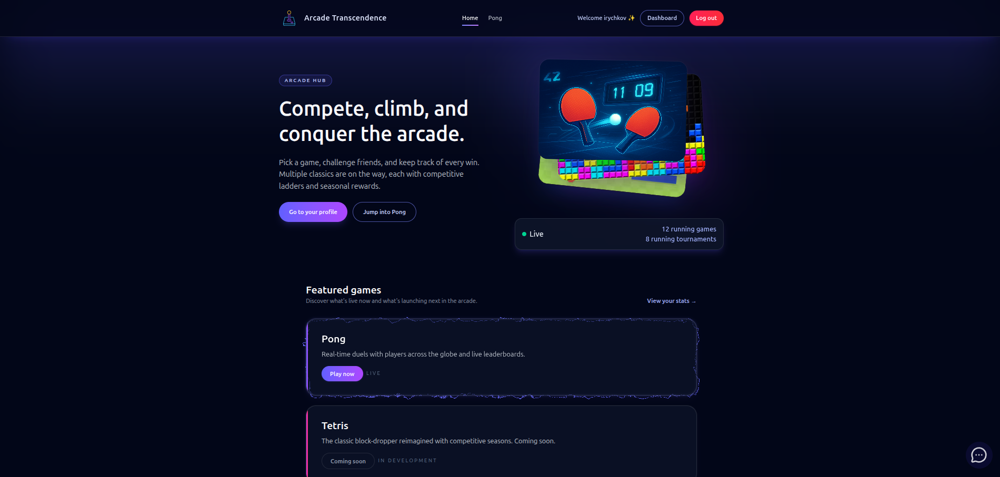

# Arcade Transcendence

[](https://github.com/juusokasperi/ft_transcendence/actions/workflows/BackendCI.yml)
[](https://github.com/juusokasperi/ft_transcendence/actions/workflows/FrontendCI.yml)
[](https://github.com/juusokasperi/ft_transcendence/actions/workflows/MakefileCI.yml)
[](https://github.com/juusokasperi/ft_transcendence/actions/workflows/ProdBuildCI.yml)
[](https://github.com/juusokasperi/ft_transcendence/actions/workflows/SyntaxCheck.yml)

A distributed, microservices-based game platform supporting both online matchmaking and local multiplayer gameplay.
Contains a fully playable 3D Pong game with real-time chat and user presence tracking.



**Live Demo**: https://irychkov.com

## Overview

Game Hub is a modern web-based gaming platform built with a scalable microservices architecture. The platform features real-time matchmaking, intelligent load balancing, persistent chat functionality, and comprehensive monitoring capabilities.

## Features

- **3D Pong Gameplay**: Fully playable online and local multiplayer 3D Pong game
- **Real-time Matchmaking**: Queue-based matchmaking system with state management
- **Tournament Support**: A tournament system for 4-player tournaments with gold, silver and bronze matches.
- **Reconnection Handling**: Resume tokens allow players to rejoin disconnected matches within a grace period
- **Live Chat System**: Real-time messaging with user profiles, invitations, and blocking functionality
- **Online Status Tracking**: Real-time user presence indicators
- **Intelligent Load Balancing**: Dynamic game server allocation based on resource metrics

## Architecture

The platform consists of containerized microservices communicating through a combination of HTTP REST APIs, WebSockets, Redis pub/sub and Redis stream messaging. Everything is developed in a single pnpm monorepo and deployed as Docker services inside a shared network, with Nginx acting as the sole external access point.

### Core Services

<details>
<summary><strong>Frontend</strong></summary>

- **Technology**: React, Vite, TypeScript, TailwindCSS, Babylon.js
- **Description**: Client-side application that renders game state and handles user interactions
</details>

<details>
<summary><strong>Database Service</strong></summary>

- **Technology**: Node.js, Fastify, TypeScript, SQLite
- **Description**: Centralized data layer providing REST API access to the database
- **Communication**: HTTP REST API
</details>

<details>
<summary><strong>Matchmaking Service</strong></summary>

- **Technology**: Node.js, Fastify, TypeScript
- **Description**: Manages player queues using a bucket system, handles match allocation, and enforces state transitions
- **Communication**: WebSocket (client), HTTP (allocator service)
- **Features**:
  - Queue-based matchmaking
  - Tournament and invite match routing
  - State machine for illegal transition prevention
  - Redis pub/sub subscription for room readiness
  - Redis stream consumer for tournament updates
  </details>

<details>
<summary><strong>Game Server</strong></summary>

- **Technology**: Node.js, Fastify, TypeScript
- **Description**: Authoritative server handling all game logic and physics
- **Communication**: WebSocket (via gateway)
- **Responsibilities**:
  - Game state simulation and validation
  - Paddle movement processing
  - Collision detection and scoring
  - Resume token generation for disconnections
  - Match result reporting to database
  - Room readiness broadcasting via Redis pub/sub
  </details>

<details>
<summary><strong>Allocator</strong></summary>

- **Technology**: Node.js, Fastify, TypeScript
- **Description**: Queries Redis for optimal game server selection and reserves rooms
- **Communication**: HTTP (matchmaking, game servers)
- **Process**:
  1. Retrieves server scores from Redis
  2. Selects least-loaded server
  3. Reserves room via game server HTTP endpoint
  4. Returns join claims to matchmaking service
  </details>

<details>
<summary><strong>Scorer</strong></summary>

- **Technology**: Node.js, Fastify, TypeScript
- **Description**: Continuously monitors game server health and calculates load scores
- **Communication**: PromQL (Prometheus), HTTP fallback
- **Metrics Tracked**:
  - Active players
  - Active matches
  - CPU load
  - File descriptor usage
  - Maximum capacity
- **Storage**: Stores scores in Redis for allocator consumption
</details>

<details>
<summary><strong>Game Gateway</strong></summary>

- **Technology**: Node.js, Fastify, HTTP proxy
- **Description**: Routes client connections to appropriate game servers with token validation
- **Communication**: WebSocket (client), HTTP proxy (game servers)
- **Process**:
  1. Validates join/resume tokens against Redis
  2. Retrieves room-to-server mapping
  3. Proxies WebSocket connection to target game server
  4. Ensures single-use token enforcement
  </details>

<details>
<summary><strong>Chat Service</strong></summary>

- **Technology**: Node.js, Fastify, TypeScript
- **Description**: Lightweight real-time messaging and presence system
- **Communication**: WebSocket
- **Features**:
  - Private and public messaging
  - User blocking/unblocking
  - Profile viewing
  - Match invitations
  - Online status tracking
- **Storage**: In-memory chat history (React context), persisted block list (database)
</details>

### Infrastructure Components

<details>
<summary><strong>Redis</strong></summary>

- **Role**: Inter-service communication and state management
- **Usage**:
  - **Pub/Sub**: Room readiness notifications (fire-and-forget)
  - **Streams**: Tournament state updates (reliable delivery)
  - **Key-Value Store**: Server scores, room mappings, token validation
  </details>

<details>
<summary><strong>Nginx</strong></summary>

- **Role**: Reverse proxy and API gateway
- **Features**:
  - Service routing
  - Token-based rate limiting
  - HTTPS termination (production)
  - External access control
  </details>

<details>
<summary><strong>SQLite</strong></summary>

- **Role**: Persistent data storage
- **Access**: Exclusively through database service
</details>

### Tooling & Quality Assurance

- **Package & Dependency Management**: PNPM manages the monorepo workspace while syncpack keeps dependency versions aligned across packages.
- **Code Style Automation**: Prettier enforces a consistent formatting baseline before every commit.
- **Testing & Verification**: Vitest powers unit and integration suites for backend services to catch regressions early.
- **Game Performance Tooling**: A custom latency compensation layer pairs Babylon.js rendering with client-side prediction and authoritative server reconciliation to keep gameplay smooth without sacrificing fairness.
- **Debugging Utilities**: Browser DevTools remain the go-to for tracing frontend issues, profiling performance, and inspecting WebSocket/HTTP traffic.

### DevOps & Monitoring

- **CI/CD Automation**: GitHub Actions workflows cover build, lint, test, and syntax checks on every push and pull request.
- **Containerization & Orchestration**: Docker images for each service are orchestrated with Docker Compose for both local development and reproducible deployments.
- **Observability Stack**: Prometheus scrapes service metrics that are visualized in Grafana dashboards, enabling proactive capacity tracking.
- **Centralized Logging**: The ELK stack (Elasticsearch, Logstash, Kibana) aggregates logs for search, correlation, and alert investigations.
- **Runtime Platform**: Oracle Cloud hosts the production stack while Cloudflare adds TLS termination, caching, and edge security hardening.
- **Automation Scripts**: Bash scripts (primarily via Makefiles) encapsulate repetitive dev and deployment tasks for consistency.

## Communication Patterns

| Source       | Destination  | Method     | Purpose              |
| ------------ | ------------ | ---------- | -------------------- |
| Client       | Frontend     | HTTP/WS    | UI interactions      |
| Client       | Matchmaking  | WebSocket  | Queue management     |
| Client       | Chat         | WebSocket  | Messaging & presence |
| Client       | Game Gateway | WebSocket  | Game connections     |
| Matchmaking  | Allocator    | HTTP       | Server allocation    |
| Allocator    | Game Server  | HTTP       | Room reservation     |
| Allocator    | Redis        | Query      | Server scores        |
| Game Server  | Database     | HTTP       | Match results        |
| Game Server  | Redis        | Pub/Sub    | Room readiness       |
| Game Gateway | Redis        | Query      | Token validation     |
| Game Gateway | Game Server  | HTTP Proxy | Connection routing   |
| Scorer       | Prometheus   | PromQL     | Metrics collection   |
| Scorer       | Redis        | Write      | Score storage        |
| Database     | Redis        | Stream     | Tournament updates   |

## Security

- Containerized services in isolated Docker network
- Single external entry point (Nginx)
- Token-based authentication and rate limiting
- Two-factor authentication
- Google Sign-In
- Single-use join tokens enforced by gateway
- HTTPS in production environment

## Getting Started

```bash
# Start all except monitoring services in dev
make
# Start all services in dev
make mon
# Start all except monitoring services in prod
make prod-slim
# Start all services in prod
make prod

# Access the application
# Navigate to http://localhost:8080
```

## Development

All backend services follow a consistent stack:

- **Runtime**: Node.js
- **Framework**: Fastify
- **Language**: TypeScript

The frontend uses:

- **Library**: React
- **Language**: TypeScript

## Monitoring

Access monitoring dashboards:

- **Grafana**: Metrics visualization
- **Kibana**: Log analysis
- **Prometheus**: Raw metrics queries

## Contributors

Created by [Iurii](https://github.com/RychkovIurii), [Juuso](https://github.com/juusokasperi), [Nicolas](https://github.com/To0nsa), [Matias](https://github.com/kerito-cl) and [Léon](https://github.com/LeonMercier)
