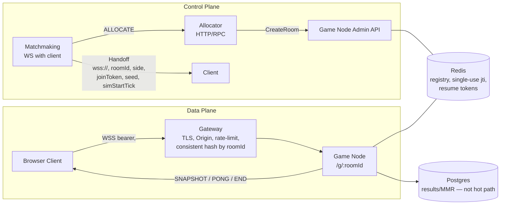
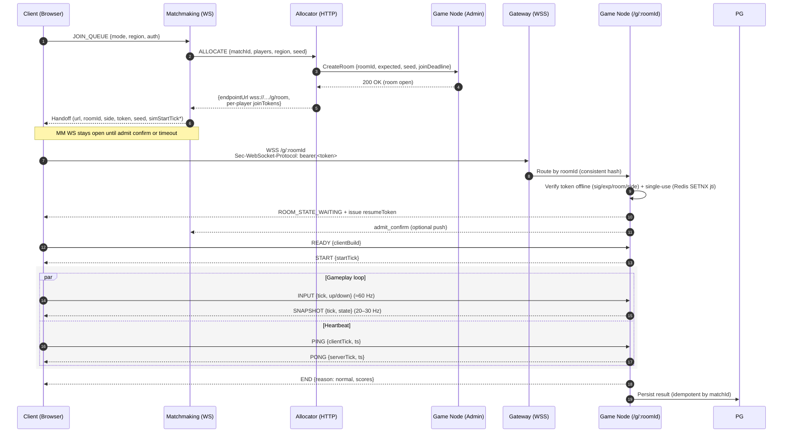
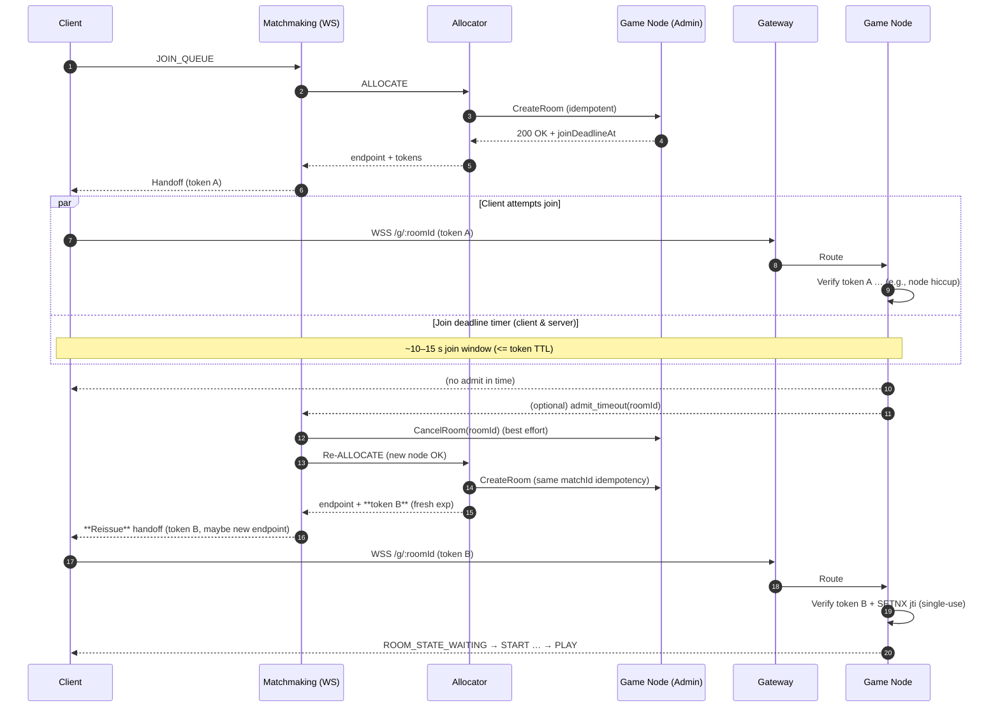
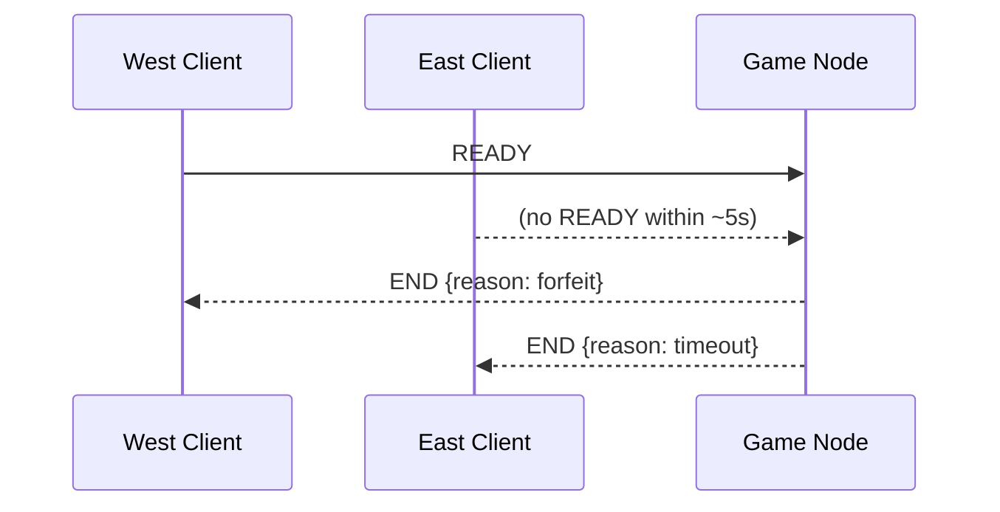

# Matchmaking & Real-time Game Networking

## Executive summary

This document is a practical blueprint for delivering a complete matchmaking and game networking stack we can be proud to showcase as a full service we designed and shipped as a team. It cleanly separates the control plane (Matchmaking + Allocator) that forms fair pairs and allocates capacity from the data plane (Gateway + Game Nodes) that runs a server-authoritative, deterministic simulation over wss://. Admission is secure and DB-free via short-lived, single-use tokens; start is synchronized via an absolute server tick; operations are production-shaped with logging, metrics, tracing, rate limits, and backpressure. Most importantly, the design is modular and reusable across our website’s game hub: to add a new game, we keep the same Gateway/Allocator/Matchmaking and protocols, and only implement a deterministic room and a tiny admin API—turning this school project into a portfolio-grade, multi-game platform component.

---

## Who is this for

- Student engineers building a portfolio-grade, team-deliverable backend for real-time multiplayer
- Teammates across frontend, backend, and infra who will integrate clients, gateway, allocator, and game nodes
- Reviewers/mentors assessing system design, security, determinism, modularity, and operational readiness
- Future maintainers who will add new games to the website’s game hub without rewriting the control plane

---

## What we can build with this

- A modular, reusable matchmaking service (Matchmaking + Allocator) that supports multiple games on the same hub
- A hardened WebSocket gateway (TLS, Origin checks, rate limits, consistent hashing) that routes by room
- A server-authoritative, deterministic game node that runs many rooms and supports short grace-window resumes
- A secure tokenized admission model (short-lived, single-use join/resume tokens verified offline)
- A baseline for observability (structured logs, key metrics, tracing) and clear failure handling
- A portable pattern we can apply to new games by implementing only “CreateRoom + /g/:roomId” with our game rules

---

## Architecture at a glance

```txt
[Browser Client]
   |  WS (JOIN_QUEUE)
   v
[Matchmaking] ---- HTTP ----> [Allocator]
   |                             |
   | handoff (wss URL + token)   | CreateRoom (admin)
   |                              v
   |                         [Game Node(s)]
   |                                   ^
   |                                   | wss (bearer joinToken)
   v                                   |
[Client via Gateway]  ----->  [Gateway (TLS, Origin, rate limit, hash by roomId)]
         |                              |
         | tokens single-use / registry |
         v                              v
      [Redis]                    [Postgres (results/MMR — not on hot path)]
```

---

## Golden rules

- `wss://` only, validate Origin.
- Tokens, not IDs (short-lived, single-use; offline verify).
- No DB on the hot path (admission/ticks). <a id="rule-no-db-hot-path"></a>
- Keep MM WebSocket open until admit (or until START if we prefer belt-and-suspenders). <a id="rule-keep-mm-ws"></a>
- Fixed timestep + tick-stamped inputs for determinism.
- Backpressure + limits at the gateway and node.
- Simple, observable flows (metrics, logs, health endpoints).

---

## Table of contents

- [Glossary](#glossary)
- [Gateway](#gateway-reverse-proxy)
- [Matchmaking](#matchmaking-mm)
- [Allocator](#allocator)
- [Game node](#game-node)
- [Persistence](#persistence)
- [Shared store](#shared-store)
- [How they talk (bird’s-eye)](#how-they-talk-birds-eye)
- [Protocol reference](#protocol-reference)
  - [MVP scope (phase 1)](#mvp-scope-phase-1)
  - [Token claims](#token-claims-authoritative)
  - [Subprotocol usage](#subprotocol-usage-client--server)
  - [Message shapes](#message-shapes-game--ws)
- [Client](#client)
  - [Client state machine](#what-is-the-client-state-machine)
  - [Client retry & backoff](#client-retry--backoff-one-liners)
  - [Minimal end-to-end loop on the client (shape)](#minimal-end-to-end-loop-on-the-client-shape)
  - [Client tips](#client-tips)
- [Defaults (timing & TTLs)](#defaults-timing--ttls)
- [Timeouts](#timeouts)
- [Policy decisions](#policy-decisions-selected)
- [Server room lifecycle](#server-game-node-room-lifecycle)
- [Numbers that work well for Pong](#numbers-that-work-well-for-pong)
- [Security & correctness](#security--correctness)
- [Observability](#observability)
  - [Structured logs](#structured-logs-what--how)
  - [Metrics](#metrics-prometheus-style)
  - [Tracing](#tracing-opentelemetry)
- [Error codes](#error-codes-taxonomy)
  - [Client UX map](#client-ux-map-errors--behavior)
- [Incident runbook](#incident-runbook-quick-checks)
- [Gateway responsibilities](#gateway-responsibilities)
- [Failure modes & handling](#failure-modes--handling)
  - [Common failures](#common-failures-what--detect--handle)
- [Organization plan](#organization-plan-multi-page)

---

## Glossary

### Identifiers and matchmaking

- **`roomIdentifier`**: Unique identifier of a game room (a single match instance). Appears in URLs as `/g/:roomId`, in join/resume tokens, and in the Redis room registry.
- **`matchId`** (aka **`idempotencyKey`**): Stable identifier for the matchmaking allocation request (and often for persistence). Used to make Allocate/CreateRoom idempotent and to correlate logs/traces. Not necessarily equal to `roomIdentifier` (though they may be derived).
- **`side`**: Canonical wire values are `west` | `east`.
- **`MMR`** (Matchmaking Rating): Skill estimate used by matchmaking queues; often based on Elo-like systems.

### Simulation and timing

- **`tick`**: Discrete simulation step number (integer). The server runs at a fixed rate (e.g., 120 Hz), and clients stamp inputs with the intended `tick`.
- **`dt`**: Fixed timestep duration in milliseconds between ticks (e.g., `8.333 ms` at 120 Hz).
- **`seed`**: RNG seed for deterministic simulation and replays. Together with the input log, it reproduces a match exactly.
- **`startTick`**: Absolute server tick at which both clients begin simulation. Chosen by the server at the start barrier and sent to clients.
- **tick drift**: Scheduling error between planned and actual tick times; an ops signal for GC/CPU pressure.

### Tokens and security

- **`JWT`** (JSON Web Token): Compact signed token used for join/resume. Offline-verifiable on the node.
  - **`iat`**: Issued-at time (epoch seconds).
  - **`exp`**: Expiration time (epoch seconds).
  - **`jti`**: Token unique ID used for single-use enforcement (guarded with Redis `SETNX`).
  - **`kid`**: Key ID identifying which signing key was used (supports rotation).
  - **`iss`** / **`aud`**: Issuer and Audience claims (e.g., `iss=mm`, `aud=game-node`).
- **`JWKS`** (JSON Web Key Set): Set of public keys used by the node to verify JWTs.
- **`HMAC`**: Symmetric signing algorithm for tokens; enables offline verification with a shared secret.
- **join token**: Short-lived, single-use token authorizing admission to a specific room/side at/around a start tick.
- **resume token**: Short-lived, single-use token authorizing rebind to an existing session within a grace window.
- **`TTL`** (Time To Live): Expiration time for tokens/keys/registry entries; keeps ephemeral state self-cleaning.
- **Redis `SETNX`**: Atomic “set-if-not-exists” used for single-use token consumption; always combined with a `TTL`.

### Networking and gateway

- **`WS`** / **`WSS`**: WebSocket over plaintext/TLS. Production requires `wss://` with strict `Origin` checks.
- **`Origin`**: Browser header identifying the page origin. Must be validated at the gateway (and optionally at the node) to prevent abuse.
- **`HSTS`** (HTTP Strict Transport Security): Forces HTTPS/WSS on future loads; configured at the gateway.
- **`X-Forwarded-For`**: Proxy header carrying the original client IP. Only trust it from known gateways; configure real_ip in production.
- **consistent hash**: Gateway routing method that maps `roomIdentifier` to a specific node so both players reach the same process.
- **`Sec-WebSocket-Protocol`**: WebSocket subprotocol header. Client proposes a single value like `bearer,<joinToken>`; the server must accept/echo the subprotocol and parse the token (see “Subprotocol usage”).

### Architecture and protocol

- **control plane**: Matchmaking + Allocator + game-node admin APIs. Pairs players, allocates rooms, issues tokens. Not on the gameplay hot path.
- **data plane**: Gateway + game node room WebSocket. Carries `READY`/`INPUT`/`SNAPSHOT`/`PING`/`END` (authoritative gameplay messages).
- **`FSM`** (Finite-State Machine): Client-side state machine that sequences `JOIN_QUEUE` → `JOINING` → `READY` → `PLAYING` → `RECONNECT/END`.
- **START barrier**: Server message instructing clients to begin at `startTick` for deterministic alignment.
- **snapshot**: Compact authoritative state sample emitted at a lower rate than the simulation tick (e.g., 25 Hz).
- **2D vector**: represented as `[x, y]` tuple for ball position in snapshots.

### Observability and performance

- **`RTT`** (Round-Trip Time): Time for a `PING` to go to the server and `PONG` to return; used to estimate one-way latency and clock offset.
- **clock offset**: Estimated difference between client and server clocks/ticks; used to align client prediction to the server timeline.
- **`SLO`** / **`p50`**/**`p95`**/**`p99`**: Service Level Objective and latency percentiles used in alerts/dashboards.
- **OpenTelemetry (`OTel`)**: Tracing standard used to follow a match across services.

### Coordination, limits, and backpressure

- **token bucket**: Rate-limiting algorithm used per-connection for `INPUT`/`PING`.
- **backpressure**: Strategy to avoid server overload due to slow clients (e.g., dropping old snapshots or closing the socket when queues grow).
- **grace window**: Period (e.g., 10–15 s) the server holds state for a disconnected player to resume.

---

## Gateway (reverse proxy)

- **Purpose:** Single public entry for `wss://`. Terminates TLS, enforces `Origin`, hides node IPs, and routes `wss://game.example/g/:roomId` to the right game node.
- **Must do:**
  - WebSocket upgrade headers, **no buffering**, tuned timeouts.
  - **Rate-limit** connection attempts + message size caps.
  - **Consistent hash** on `roomId` so both players hit the same node.
  - Forward `Sec-WebSocket-Protocol` so the join token reaches the node.

- **Why it matters:** Security (TLS/WAF), stability (one chokepoint for backpressure), observability (connect/disconnect logs), and zero exposure of private ports.
- **Common tools:** Nginx/Caddy/Envoy; optional CDN with WS pass-through for DDoS absorption.

---

## Matchmaking (MM)

- **Purpose:** Owns queues and pairing logic (mode, region, MMR). Issues **short-lived, single-use join tokens** after capacity is confirmed.
- **Flow:**

1. Client `JOIN_QUEUE`.
2. MM finds opponent → calls **Allocator**.
3. When room is created, MM sends **handoff** `{gameServerWebSocketUrl, roomIdentifier, side, joinToken, randomSeed, simulationStartTick}` (simulationStartTick is provisional; the game node announces the authoritative startTick via `START`).
4. **Keeps MM WS open** until join confirmed/timeout (so it can re-issue handoff if join fails). — see [Golden rules](#rule-keep-mm-ws)

- **Data:** Auth (site JWT), lightweight player profile (MMR), queued intents, anti-leave timers.
- **Gotchas:** Never trust client IDs; **tokenize** all authority (claims in the token), and keep requeue/timeout paths simple.

---

## Allocator

- **Purpose:** Capacity broker. Picks a **game node** (or spins one up), tells it to **CreateRoom**, then returns **per-player tokens** to MM.
- **Inputs:** `{mode, region, players[]}`.
- **Outputs:** `{roomIdentifier, perPlayerJoinTokens, endpointUrl}`.
- **Policy signals:** Node load, region affinity, socket count, per-node room cap.
- **Shape:** Stateless HTTP/RPC service; easy to scale horizontally.
- **Why separate from MM:** Clear separation of concerns: MM focuses on pairing fairness; Allocator focuses on capacity and placement.

---

## Game node

- **Purpose:** Hosts many **Room** instances and runs the **server-authoritative, deterministic simulation**.
- **Join path:**
  - Routed by Gateway to `/g/:roomId`.
  - During upgrade, accept/echo the subprotocol and parse the token from `Sec-WebSocket-Protocol` (format: `bearer,<joinToken>`), then verify the **join token offline** (shared secret/JWKS).
  - Attaches socket → emits `ROOM_STATE_WAITING` → waits `READY` → sends `START { startTick }`.

- **During match:**
  - **Fixed timestep** sim (e.g., 120 Hz); no per-tick allocations (object pools).
  - Accept **tick-stamped INPUT**; clamp, fill gaps; broadcast **SNAPSHOT** at 20–30 Hz.
  - **Resume** within grace window via `resumeToken`.

- **After match:** Emit `END`, push result to Persistence, free room after a short grace.
- **Gotchas:** Keep admission **DB-free**; guard against spam (rate limits), cap message sizes, and use structured logs per room.

---

## Persistence

- **Purpose:** Durable records outside the hot path—**results, ELO/MMR updates, audits/replays**.
- **When used:** End of match (or periodic checkpoints). **Never** block admission or ticks on DB I/O.
- **Shape:** Postgres (or similar). Idempotent writes (use matchId as natural key). Background workers for recalculations/leaderboards.
- **Extras:** Optional event log for replays (seed + inputs) to reproduce matches.

---

## Shared store

- **Purpose:** Fast, ephemeral coordination. **Redis** is perfect for:
  - Room registry (node → active `roomIdentifier`s).
  - One-time token consumption (SETNX + TTL).
  - Resume tokens (short TTL).
  - Node heartbeats / capacity counters.

- **Why separate from DB:** Millisecond ops, TTL semantics, and atomic primitives (locks/counters) without the weight of SQL.

---

## How they talk (bird’s-eye)

1. **Client → MM (WS):** `JOIN_QUEUE`.
2. **MM → Allocator (HTTP):** `ALLOCATE`.
3. **Allocator → Game node (HTTP admin):** `CreateRoom` → returns `roomIdentifier`.
4. **Allocator → MM:** per-player **join tokens** + `endpointUrl`.
5. **MM → Client (WS):** **handoff** (keep MM WSS open — see [Golden rules](#rule-keep-mm-ws)).
6. **Client → Gateway (WSS):** connects to `/g/:roomId` with `Sec-WebSocket-Protocol: bearer,<joinToken>`.
7. **Gateway → Node:** routes to the right process; node **verifies token offline**, runs the room.
8. **Node → Persistence:** write results/ELO at the end.
9. **Redis:** glue for tickets/registry/resume.

---

## Protocol reference

Authoritative wire contracts for both control plane (Matchmaking/Allocator) and data plane (Game WebSocket). All other sections should link here rather than redefining shapes.

Conventions:

- Time units: fields suffixed with AtMs are epoch milliseconds; tick fields are integers on the server’s simulation timeline.
- Sides: use "west" | "east" only (canonical); scores are scoreW/scoreE.
- Tokens: short-lived (≤60 s for join; ≈15 s for resume) and single-use; verified offline.
- Identifiers: prefer `roomId` on the data plane (endpoints, logs); use `roomIdentifier` on the control plane (handoff/token claims). Avoid mixing both names within the same wire shape.

### MVP scope

- Single region.
- Ed25519 (EdDSA) keys for token signing from day one; signers = MM/Allocator, verifiers = game nodes (offline via JWKS). Avoid HS256 in production to prevent a compromised node from minting tokens.
- JSON protocol for all messages (binary snapshots can be a future optimization).
- Persistence only for match results (no other DB on the hot path).
- Key rotation with overlap window (≥ 2× longest TTL) and JWKS hot‑reload included in MVP.

Why join token TTL (≤60 s) > join deadline (10–15 s)

- Purpose: the extra TTL margin absorbs client backoff/retry, gateway hiccups, clock skew, and MM re-issue flows while the MM control socket stays open.
- Practice: nodes still enforce the shorter join window (10–15 s) for admission; tokens become single-use on first admit attempt (Redis `SETNX jti`).
- Rule of thumb: joinWindowMs = min(tokenTTLms − skewSafetyMs, 15000) with skewSafetyMs ≈ 2000.

### Token claims (authoritative)

- Header: `{ alg: "EdDSA" | "HS256", kid: string }` (MVP: `EdDSA`).
- Units: `iat/exp` are epoch seconds; deadlines in this doc use milliseconds unless noted.
- Join token (`JoinTokenClaims`):
- `iss: "mm"`, `aud: "game-node"`
- `iat: number`, `exp: number`, `jti: string`
- `roomIdentifier: string`
- `sub: string` (playerIdentifier)
- `side: "west" | "east"`
- `simulationStartTick?: number` (advisory; node announces authoritative `startTick`)
- MUST be short-lived (≤60s) and single-use (consume `jti` via Redis `SETNX` + TTL)
- Resume token (`ResumeTokenClaims`):
- `iss: "node"`, `aud: "game-node"`
- `iat?: number`, `exp: number`, `jti: string`
- `roomIdentifier: string`
- `sub: string` (playerIdentifier)
- `sessionIdentifier: string`
- TTL ≈ 15s; single-use via Redis `SETNX` + TTL
- Verification: nodes verify tokens offline (signature + exp + audience/issuer) using an Ed25519 public key (by `kid`). HS256 may be used only for local testing; avoid in production.
- Rotation: keep previous `kid` active for verification for ≥ 5 minutes to cover in-flight tokens; always sign new tokens with the latest key.

---

### Control Plane vs Data Plane — Compact Overview

> One-page visual orientation for our online Pong stack. Top = control plane (pairing + capacity + tokens). Bottom = data plane (authoritative gameplay over WSS). Redis is the fast glue; Postgres is off the hot path.



### **Legend**

- **Control plane**: Matchmaking pairs players, Allocator finds capacity, Node admin opens room & seeds tokens.
- **Data plane**: Client connects via Gateway to authoritative room.
- **Security**: `wss://`, strict `Origin`, **join tokens** in `Sec-WebSocket-Protocol: bearer,<token>`, **single‑use** via Redis `SETNX jti`.
- **Determinism**: fixed tick, server sets **startTick**, client waits for `START`.

---

### Sequence — Happy Path (Join → Start → Play → End)



_`simStartTick` in handoff is advisory; **authoritative** startTick is announced by the node in `START`._

---

### Sequence — Join Reissue on Timeout (Token/Admit deadline)

> If the client fails to be **admitted** within the join window (≈10–15 s), MM **re-issues** a fresh handoff without sending the player back to the search screen.



> **Policies & notes**
> Keep **MM WS open** until the node sends admit confirmation; this enables seamless reissue.
> Join window sized by `min(tokenTTL - skewSafety, 15s)`.
> Tokens are **short-lived & single-use**; reissue = new token (and possibly new room/node).
> Admission is **DB-free**; only Redis for single-use and registry.

---

## READY timeout (forfeit policy)



---

## Quick checklist (to align code & ops)

See also: [Incident runbook](#incident-runbook-quick-checks) for operator-focused quick checks.

- `wss://` only; strict **Origin** at gateway (and optionally node).
- Handoff carries **url, roomId, side, token, seed, simStartTick**; client must wait for `START`.
- Node **verifies token offline** and enforces **single-use** with Redis `SETNX jti` + TTL.
- **Join deadline** ≈ 10–15 s; **READY deadline** ≈ 5 s; **heartbeat** every \~5 s; **resume** grace ≈ 10–15 s.
- Persistence off hot path; idempotent writes by `matchId`.

---

### Control plane (Matchmaking ↔ Client, MM ↔ Allocator)

```ts
// Client → Matchmaking (WebSocket)
export type JoinQueueRequest = {
  /** Game mode the player wants to join. Only "ranked" for now. */
  mode: 'ranked';
  /** Optional geographic region or shard name (e.g., "eu-central"). 2..32 chars. */
  region?: string;
  /** Auth token from site login (opaque JWT string). Max ~4096 chars. */
  authenticationToken: string;
  /** Optional matchmaking rating for pairing. Integer, e.g., 0..5000. */
  matchmakingRating?: number;
};

// Matchmaking → Client (WebSocket)
export type MatchHandoffMessage = {
  /** Full WSS URL, e.g., "wss://game.example/g/<roomIdentifier>". */
  gameServerWebSocketUrl: string; // MUST be wss://
  /** Server-side room identifier. 1..64 chars. */
  roomIdentifier: string;
  /** Side assignment for this client. */
  side: 'west' | 'east';
  /** Deterministic RNG seed for gameplay/replay. Unsigned 32-bit. */
  randomSeed: number;
  /** Provisional start tick suggested by control-plane; final is set by the game node and announced via START { startTick }. Clients MUST wait for START. */
  simulationStartTick: number;
  /** Short-lived, single-use token to present at game join (JWT/HMAC). */
  joinToken: string; // Max ~2048 chars
  /** TTL for the join token, in seconds. Default: 60. */
  joinTokenTimeToLiveSeconds: number;
};

// Claims inside the join token (node verifies offline)
export type JoinTokenClaims = {
  /** Player identifier (maps to JWT "sub"). */
  playerIdentifier: string;
  /** Room identifier this token is valid for. */
  roomIdentifier: string;
  /** Side assignment. */
  side: 'west' | 'east';
  /** Optional target region/shard. */
  region?: string;
  /** Provisional start tick. Node sets the authoritative start tick and announces it via START. */
  simulationStartTick: number;
  /** Issued-at time (epoch seconds). Maps to JWT "iat". */
  issuedAtEpochSeconds: number;
  /** Expiration time (epoch seconds). Maps to JWT "exp". */
  expiresAtEpochSeconds: number;
  /** Unique token id for single-use enforcement. Maps to JWT "jti". */
  jti: string;
};

// Matchmaking → Allocator (HTTP/RPC)
export type AllocateRequest = {
  /** Stable match identifier. Also used as idempotency key. */
  idempotencyKey: string; // e.g., matchId, 16..64 chars
  mode: 'ranked';
  region: string; // e.g., "eu-central"
  players: ReadonlyArray<{ playerIdentifier: string; side: 'west' | 'east' }>;
  randomSeed: number; // unsigned 32-bit
  simulationStartTick: number; // may be provisional; node sets final startTick
};

export type AllocateResponse = {
  roomIdentifier: string;
  endpointUrl: string; // wss://game.example/g/<roomIdentifier>
  perPlayerJoinTokens: Record<string /*playerIdentifier*/, string /*joinToken*/>;
};

// Allocator → Game node (HTTP admin)
export type CreateRoomRequest = {
  idempotencyKey: string; // same as matchId
  roomIdentifier: string;
  capacity: 2;
  expectedPlayers: ReadonlyArray<{ playerIdentifier: string; side: 'west' | 'east' }>;
  randomSeed: number;
  simulationStartTick: number;
  /** Client join deadline in epoch ms (now + 10–15s). */
  joinDeadlineAtEpochMs: number;
};
```

Notes:

- Authentication: the website JWT is consumed by Matchmaking only; game nodes never call a DB or identity provider on join.
- Authoritative start tick: the game node sets the definitive startTick. Any simulationStartTick in Allocate/CreateRoom/JoinToken/Handoff is advisory; clients MUST wait for START { startTick } from the node.
- Token verification: nodes verify joinToken offline (HMAC/JWT), enforce single-use via Redis SETNX on jti, and check exp.
- Defaults: joinTokenTimeToLiveSeconds=60, join deadline 10–15s.

### Data plane (Game WebSocket /g/:roomId)

```ts
// Client → Server (WS data plane)
export type ClientToServer =
  | { t: 'READY'; v: { clientBuild: string /* ≤32 chars */ } }
  | { t: 'INPUT'; v: { tick: number /* int */; up: boolean; down: boolean } }
  | { t: 'PING'; v: { clientSentAtMs: number /* epoch ms */; clientTick: number /* int */ } }
  | { t: 'RESUME'; v: { resumeToken: string /* ≤2048 chars */ } };

// Server → Client (WS data plane)
export type ServerToClient =
  | { t: 'ROOM_STATE_WAITING'; v: { playersPresent: 0 | 1 | 2 } }
  | { t: 'START'; v: { startTick: number /* int */ } }
  | {
      t: 'SNAPSHOT';
      v: {
        tick: number;
        ball: [number, number];
        west: number;
        east: number;
        scoreW: number;
        scoreE: number;
      };
    }
  | {
      t: 'PONG';
      v: {
        clientSentAtMs: number;
        serverReceivedAtMs: number;
        serverSentAtMs: number;
        serverTick: number;
      };
    }
  | { t: 'END'; v: { reason: 'normal' | 'forfeit' | 'timeout'; scoreW: number; scoreE: number } };
```

Constraints and limits:

- Max payload per WS frame: 2 KB (server closes with 1009 if exceeded).
- Input window: server accepts INPUT where tick ∈ [currentTick - backlog, currentTick + lead] with backlog≈ceil(maxRTT/dt), lead≈1–2.
- Heartbeat: client PING every ~5 s; declare link dead after N misses (e.g., N=3 ⇒ ~15–20 s).
- Resume token TTL: ~15 s; single-use enforced via Redis SETNX on jti.

Note: See Golden rules — [No DB on the hot path](#rule-no-db-hot-path).

---

### Subprotocol usage (client ↔ server)

Why: Browsers cannot set arbitrary headers on WebSocket upgrade. We carry the join token in the subprotocol proposal so the node can verify it on admit.

Recommended shape: propose a single subprotocol value that encodes the scheme and token: `"bearer,<joinToken>"`. Some libraries split subprotocols by commas; others require a single string. Follow these rules:

- Client proposes exactly one subprotocol string containing both the scheme and token (prefer `"bearer,<joinToken>"`; if our library disallows commas in a subprotocol token, use `"bearer.<joinToken>"` and split on the first `.` on the server).
- Server must accept/echo the subprotocol during the handshake, and parse the token from the request’s `Sec-WebSocket-Protocol` header.
- Do not pass two separate entries (e.g., `["bearer", joinToken]`) — some servers will accept only `"bearer"` and we will lose access to the token.

Client (browser):

```js path=null start=null
const url = `wss://game.example/g/${roomIdentifier}`;
// Propose a single subprotocol string that includes the token
const ws = new WebSocket(url, `bearer,${joinToken}`);
```

Server (Node, ws):

```ts path=null start=null
import { WebSocketServer } from 'ws';

const wss = new WebSocketServer({
  server,
  handleProtocols: (protocols, req) => {
    // Raw header preserves the exact proposal, e.g., "bearer,<token>"
    const raw = String(req.headers['sec-websocket-protocol'] || '');
    const [proto, token] = raw.split(',', 2).map((s) => s.trim());
    if (proto !== 'bearer' || !token) return false; // reject
    (req as any).joinToken = token;
    // Echo the subprotocol to finalize negotiation (what the client proposed)
    return raw;
  },
});

wss.on('connection', (ws, req) => {
  const token = (req as any).joinToken;
  // verify token offline, then admit
});
```

Server (uWebSockets.js):

```ts path=null start=null
uWS.App().ws('/g/:roomId', {
  upgrade: (res, req, context) => {
    const raw = req.getHeader('sec-websocket-protocol'); // e.g., "bearer,<token>"
    const [proto, token] = raw.split(',', 2).map((s) => s.trim());
    if (proto !== 'bearer' || !token) {
      res.close();
      return;
    }
    // Echo the accepted subprotocol in the response
    res.upgrade(
      { joinToken: token },
      req.getHeader('sec-websocket-key'),
      req.getHeader('sec-websocket-protocol'), // echoes raw
      req.getHeader('sec-websocket-extensions'),
      context,
    );
  },
  open: (ws) => {
    const token = (ws as any).joinToken;
    // verify token offline
  },
});
```

> Notes:
> The gateway must forward the `Sec-WebSocket-Protocol` request header to the node, and the node must echo the selected subprotocol in the 101 response. Most reverse proxies (including Nginx) forward it by default.
> Echoing the full proposal (e.g., `bearer,<token>`) keeps strict libraries happy; if our library insists on echoing only `bearer`, ensure we have access to the raw request header to parse the token before it’s normalized.

---

## Key management & rotation

**Goal:** sign **join/resume tokens** in the control-plane, verify **offline** on game nodes, rotate keys without restarts, and never block gameplay on a DB.&#x20;

---

## Where keys live

- **Signing (private) keys:** **Matchmaking/Allocator** only. They mint **short-lived, single-use** JWTs (join ≈60s, resume ≈15s).&#x20;
- **Verification keys:** **Game nodes** only. Nodes load a small **JWKS** (one or more public keys) and verify tokens **offline**; single-use enforced via Redis `SETNX` on `jti`.&#x20;
- **Gateway:** never sees private keys; it only forwards the `Sec-WebSocket-Protocol` header carrying `bearer,<token>`.&#x20;

> Default algo: **Ed25519 (EdDSA)** or **ES256** for public-key verification (preferred). A simpler alternative is **HS256** (shared secret) across MM + nodes, but that widens blast radius—prefer asymmetric when possible.&#x20;

### JWKS example (Ed25519)

```json
{
  "keys": [
    {
      "kty": "OKP",
      "crv": "Ed25519",
      "kid": "2025-09-14-a",
      "x": "Q0uV3kM6x1c1RZx1f5n2w9Qe0tY8oMxz4F8oTg1ic1U"
    },
    {
      "kty": "OKP",
      "crv": "Ed25519",
      "kid": "2025-08-01-b",
      "x": "uS3z7qhzE-w8b6H2r0s6rH6V0tqk1oC1M-5nZ1v5y4w"
    }
  ]
}
```

### Verifier snippet (Node, jose; verify by `kid`)

```ts
import { createLocalJWKSet, jwtVerify } from 'jose';

// JWKS should be loaded from a file/URL and hot‑reloaded on change.
// For illustration we inline two Ed25519 public keys:
const jwks = createLocalJWKSet({
  keys: [
    { kty: 'OKP', crv: 'Ed25519', kid: '2025-09-14-a', x: '...' },
    { kty: 'OKP', crv: 'Ed25519', kid: '2025-08-01-b', x: '...' },
  ],
});

export async function verifyJoinToken(token: string) {
  const { payload, protectedHeader } = await jwtVerify(token, jwks, {
    algorithms: ['EdDSA'],
    issuer: 'mm',
    audience: 'game-node',
    maxTokenAge: '60s',
    clockTolerance: '2s',
  });
  // Enforce single‑use elsewhere (Redis SETNX join:jti:<jti> with TTL)
  return { payload, kid: protectedHeader.kid };
}
```

### Signer snippet (MM/Allocator; Ed25519, jose)

```ts
import { SignJWT, importJWK } from 'jose';
import { randomUUID } from 'crypto';

// Ed25519 private JWK (keep in a secret mount or env; rotate by kid)
const privateJwk = {
  kty: 'OKP',
  crv: 'Ed25519',
  kid: '2025-09-14-a',
  d: '...', // private
  x: '...', // public
} as const;

const signer = await importJWK(privateJwk, 'EdDSA');

export async function mintJoinToken(
  claims: {
    roomIdentifier: string;
    playerId: string;
    side: 'west' | 'east';
    simulationStartTick?: number;
  },
  ttl: string = '60s',
) {
  const now = Math.floor(Date.now() / 1000);
  const jti = randomUUID();
  const payload: any = {
    roomIdentifier: claims.roomIdentifier,
    sub: claims.playerId,
    side: claims.side,
    iat: now,
    jti,
  };
  if (claims.simulationStartTick !== undefined)
    payload.simulationStartTick = claims.simulationStartTick;

  const token = await new SignJWT(payload)
    .setProtectedHeader({ alg: 'EdDSA', kid: privateJwk.kid })
    .setIssuer('mm')
    .setAudience('game-node')
    .setExpirationTime(ttl)
    .sign(signer);

  // Enforce single‑use elsewhere (Redis SETNX join:jti:<jti> with TTL)
  return token;
}
```

---

## How `kid` works

- Every key pair has a **Key ID (`kid`)**. The signer sets `kid` in the JWT header; nodes pick the matching public key from JWKS to verify. Keep **old + new** keys loaded during rotation so **both** kids validate.&#x20;

---

## Rotation cadence & overlap

- **Rotate** signing keys on a schedule (e.g., weekly/monthly) or immediately if compromised.
- **Overlap window:** keep the **previous key** in the JWKS for **≥ 2× the longest token TTL** (join 60s, resume 15s ⇒ overlap ≥ **5 minutes** is safe and simple). During overlap, **sign with the new key** only; **verify with both**. After overlap, drop the old key from JWKS.&#x20;

---

## Reloading keys without restarts

**Control-plane (signers):**

- Load active signing key from a secret mount or env var; **hot-swap** on SIGHUP or file-watcher change (no process restart).&#x20;

**Game nodes (verifiers):** pick **one**:

1. **Pull model (simple):** poll a small JWKS JSON (env/file/HTTP) every **30–60s**; replace the in-memory verifier set atomically if the content (or `kid` set) changed.
2. **Push model (faster):** MM publishes a `keys.rotate` message (Redis Pub/Sub). Nodes replace their **in-memory JWKS** immediately (still keep old+new during the overlap).

Either way, verification switches to the new set **without dropping rooms**; unknown `kid` → reject token, client stays on MM and gets a **re-issued** handoff (fresh token).&#x20;

---

## Minimal implementation notes

- **JWT header:** `{ alg: "EdDSA", kid: "<uuid>" }`. Claims include `iss=mm`, `aud=game-node`, `iat`, `exp`, `jti`, `roomIdentifier`, `side`, and (advisory) `simulationStartTick`. Nodes verify **signature + exp + audience/issuer**, then enforce **single-use** via Redis `SETNX jti` + TTL.&#x20;
- **Secrets delivery:** mount via Docker/K8s **secrets volumes**; avoid baking keys into images. Keep a **JWKS file** (public keys) for nodes and a **private key file** (signer).&#x20;
- **Failure policy:** if a token’s `kid` isn’t recognized or signature fails → close WS with policy code and surface `TOKEN_INVALID|TOKEN_EXPIRED`; MM immediately **re-issues** fresh tokens thanks to the still-open MM socket.&#x20;

> This stays aligned with our design: **short-lived, single-use tokens** verified **offline**, **no DB on the hot path**, and clear `kid`-based rotation with overlap + hot reload.&#x20;

---

### Message shapes (Game <-> WS)

These messages define the deterministic protocol our browser client uses to talk to the authoritative game room over WebSockets (READY → INPUT → SNAPSHOT, with PING/PONG and RESUME). For the complete, authoritative type definitions (including constraints, units, TTLs, and defaults), see Protocol reference → Data plane (Game WebSocket).

> RTT = Round-Trip Time: how long it took for the PING to go to the server and the PONG to come back. We use it to estimate one-way latency ≈ RTT/2.
> offset = an estimate of the clock/tick difference between client and server. We use it to align client prediction with the server’s authoritative timeline.

Units per message fields (explicit)

- Ticks: integers on server timeline (e.g., `tick`, `startTick`).
- Milliseconds: `...AtMs` fields use epoch milliseconds (e.g., `joinDeadlineAtMs`).
- Seconds: JWT `iat`/`exp` are epoch seconds.

Canonical shapes (compact)

```ts
type ReadyMsg = { t: 'READY'; v: { clientBuild: string } };
type InputMsg = { t: 'INPUT'; v: { tick: number; up: boolean; down: boolean } };
type SnapshotMsg = {
  t: 'SNAPSHOT';
  v: {
    tick: number;
    ball: [number, number];
    west: number;
    east: number;
    scoreW: number;
    scoreE: number;
  };
};
type PingMsg = { t: 'PING'; v: { clientTick: number; clientAtMs: number } }; // ms
type PongMsg = { t: 'PONG'; v: { serverTick: number; serverAtMs: number; echoClientAtMs: number } }; // ms
type StartMsg = { t: 'START'; v: { startTick: number } };
type EndMsg = {
  t: 'END';
  v: { reason: 'normal' | 'forfeit' | 'timeout' | 'abort'; scoreW: number; scoreE: number };
};
type ResumeMsg = { t: 'RESUME'; v: { resumeToken: string } };
type ResumeTok = { t: 'RESUME_TOKEN'; v: { resumeToken: string } }; // server push (rotation)
type ErrorMsg = { t: 'ERROR'; v: { code: string; hint?: string } };
```

Quantization rule (determinism & replay)

- Round numeric positions/speeds sent in `SNAPSHOT` to 3 decimals, or use fixed‑point integers scaled by 1e3. This avoids client‑side visual jitter and stabilizes replays.

Backpressure policy (outbound)

- If a connection’s outbound queue exceeds 32 messages or 128 KiB, drop intermediate `SNAPSHOT`s and send only the latest (newest wins).
- If this condition persists for > 2 seconds, close the socket with `1001` (going away) to protect the room.

Encoding policy

- MVP: JSON for all messages (easy to debug). Future: optional binary snapshots with a tiny schema once correctness is proven.

---

## Client

### What is the client state machine?

A small **finite-state machine (FSM)** in the browser that governs the player’s journey—queueing, handoff, joining, playing, reconnecting—so networking/UI side effects happen **once**, in the **right order**, with clear **timeouts** and **retries**. It prevents “spaghetti” (double connects, ghost rooms, stuck UIs) and keeps the game **deterministic** (e.g., start barriers, fixed ticks).

---

### States & responsibilities

### 1. `IDLE`

**Purpose:** Neutral baseline; no live sockets.
**Enter when:** App loads, or after a match when the user isn’t seeking rematch.
**Do:** Reset ephemeral net state (tokens, timers, room id), clear UI.
**Exit to:** `MM_CONNECT` when user clicks “Play Online”.
**Failure/Timeout:** N/A.

### 2. `MM_CONNECT`

**Purpose:** Connect to **Matchmaking** and request a game.
**Enter when:** User wants online play.
**Do:** Open MM WebSocket; send `JoinQueueRequest` (mode/region/auth). Show “Searching…”.
**Exit to:**

- `MATCHED` on handoff received.
- `IDLE` if user cancels.
  **Failure/Timeout:** If MM socket drops, backoff + retry or go `IDLE` with an error toast.

### 3. `MATCHED`

**Purpose:** Receive the **handoff** (endpoint, room id, join token, start tick, seed).
**Do:** Validate payload shape, cache token; **start join deadline timer (10–15s)**. **Keep MM WSS open.**
**Exit to:** `JOINING` immediately (don’t wait).
**Failure/Timeout:** If handoff incomplete/expired, stay on MM and request reissue.

### 4. `JOINING`

**Purpose:** Establish **WSS** to the game endpoint.
**Do:** Open WSS to `wss://…/g/:roomId` with `Sec-WebSocket-Protocol: bearer,<joinToken>`.
**Exit to:**

- `WAITING_READY` once admitted by the game node.
- Back to `MM_CONNECT` (or `MATCHED`) if connect fails or **join deadline** elapses—MM can re-allocate and send a fresh handoff.
  **Failure/Timeout:** Token invalid/expired, DNS/TLS errors, or gateway rejects → notify MM over the still-open MM socket.

### 5. `WAITING_READY`

**Purpose:** Confirm readiness and wait for both players.
**Do:** Send `READY { clientBuild }`; show “Waiting for opponent…”. Start **READY deadline (\~5s)**.
**Exit to:**

- `PLAYING` on `START { simulationStartTick }`.
- `MM_CONNECT` if the other player never joins (MM may re-match) or if READY deadline triggers a forfeit/abort.
  **Failure/Timeout:** READY deadline exceeded → follow server’s `END`/abort protocol.

### 6. `PLAYING`

**Purpose:** Normal gameplay against the **authoritative server**.
**Do:**

- Send **tick-stamped `INPUT`** at a fixed cadence (e.g., 60 Hz).
- Apply `SNAPSHOT`s (20–30 Hz); optional light client prediction for paddle.
- Maintain heartbeat: send `PING` every \~5s (or rely on WS ping/pong).
  **Exit to:**
- `END` on server `END { reason }`.
- `RECONNECT` if WS drops unexpectedly.
  **Failure/Timeout:** If input send queue overflows or too many missed heartbeats, proactively transition to `RECONNECT`.

### 7. `END`

**Purpose:** Wrap up the match.
**Do:** Show final scores; close game WS; optionally send telemetry. Offer **Rematch**.
**Exit to:**

- `MM_CONNECT` (Rematch or “Play Again”), optionally with priority.
- `IDLE` if the user leaves.
  **Failure/Timeout:** N/A.

### 8. `RECONNECT` (optional)

**Purpose:** Seamless resume after transient drops.
**Do:** Within \~10–15s grace, reconnect to the same endpoint; send `RESUME { resumeToken }`.
**Exit to:**

- `PLAYING` on successful resume.
- `END` if grace expired or server ended the match (forfeit/timeout).
  **Failure/Timeout:** Exhausted retry budget or resume rejected → go `END`.

---

### Client retry & backoff (one-liners)

- **Join**: immediate attempt; on failure, wait for **MM re-handoff** (don’t spam reconnects).
- **Resume**: 0.5s → 1s → 2s backoff within 10–15s grace, then stop.
- **Handshake limits**: respect gateway 429s; show UX hint rather than loop.

### Minimal end-to-end loop on the client (shape)

```ts
// On START
targetStartTick = msg.v.startTick;

// Each render frame
while (localTick < serverTickEstimate()) {
  // predict locally using last input
  simulateClientTick(localInputAt[localTick] ?? lastInput);
  localTick++;
}

applyLatestSnapshotIfNewer(); // reconcile small errors (paddle)
```

This keeps our gameplay deterministic, our netcode simple and fast, and our replays bit-for-bit reproducible from `{seed + inputs}`.

### Client tips

- Keep the latest issued `resumeToken` (replace on each rotation).
- On drop, immediately try resume; back off (e.g., 0.5s, 1s, 2s) within grace.
- If resume succeeds, smooth any visual jump by lerping toward the new snapshot for a few frames.

### TL;DR

- Short-lived, single-use resume tokens, rotated every few seconds.
- 15 s grace per player slot; server keeps sim authoritative.
- Fast resync on resume; deterministic behavior defined upfront.
- Cheap to verify, simple to reason about, and resilient to real-world network hiccups.

---

## Defaults (timing & TTLs)

- Tick rate: 120 Hz (dt ≈ 8.333 ms)
- Input send: ~60 Hz; Snapshot send: 20–30 Hz
- Join token TTL: ≤ 60 s; Resume token TTL: ≈ 15 s
- Join window: `min(tokenTTLms - 2000, 15000)` (≈ 10–15 s)
- READY deadline: ~5 s
- Heartbeat: send every ~5 s; declare dead after N=3 misses (≈ 15–20 s)
- Disconnect grace: 10–15 s
- Room registry TTL: 60–90 s (join window + margin)
- Gateway `proxy_read_timeout`: 75 s (keep within 60–90 s)
- Key rotation overlap: keep previous `kid` verifying for ≥ 5 minutes
- Input backlog window: ceil(maxRTT / dt) (e.g., ~6 ticks for ~50 ms RTT); lead window: 1–2 ticks

Acceptance window math (single source)

- Let `dtMs = 1000 / tickHz` (e.g., 8.333… ms @ 120 Hz).
- Choose target `maxRttMs` (e.g., 50 ms for casual play).
- Backlog ticks = `ceil(maxRttMs / dtMs)` (e.g., 6).
- Lead ticks = `min(2, max(1, floor(backlog/3)))` (tiny prediction tolerance).
- Accept inputs only if `tick ∈ [currentTick − backlog, currentTick + lead]`.
- Fill gaps by reusing the last known input (hold behavior).

---

## Timeouts

### Join deadline (10–15 s)

**What:** Max time between receiving the **handoff** and being **admitted** by the game node.
**Why:** Prevents stale/invalid tokens and rooms sitting open; lets MM quickly re-allocate if a node is slow or a client is firewalled.
**Starts:** At **handoff receipt** on the client (and/or at token issuance server-side).
**Sizing:** `joinWindowMs = min( tokenTTLms - skewSafetyMs, 15000 )` where `skewSafetyMs ≈ 2000`.
**Client on expiry:** Abort the in-flight join, **keep MM WS**, ask MM to re-issue a fresh handoff (new token/room).
**Server on expiry:** If expected players didn’t arrive, **close room** and free capacity.
**Notes:** Verify tokens **offline**; make tokens **single-use** so retries don’t collide with half-opens.

### READY deadline (\~5 s)

**What:** Max time from **admit** to receiving the client’s `READY`.
**Why:** Stops griefing (one side never pressing “ready”) and avoids long lobby stalls.
**Starts:** When each player is admitted to the room.
**Sizing:** 3–7 s is ample for asset-ready UIs.
**Policy (selected):** If only one player sends READY by the deadline, **forfeit the non-ready side**. Persist result (forfeit) and apply MMR update if we have one. If neither is ready, abort with no result. Notify MM if we track penalties/cooldowns.
**Bonus:** Include `clientBuild` in `READY` to **gate versions** (mismatch → immediate abort with a clear error).

### In-match heartbeat (\~5 s)

**What:** Periodic **application-level PING** from client; server replies `PONG` (echoing client time + including server times/tick).
**Why:** Detects **half-open** connections that TCP/WS may not reveal quickly (mobile sleep, Wi-Fi roam, middleboxes). Also gives **RTT** and **clock/tick offset** for prediction.
**Starts:** At `PLAYING`.
**Sizing:** Send every **5 s**, declare the link dead after **N missed heartbeats** (e.g., N=3 → \~15–20 s).
**Client on misses:** Transition to `RECONNECT`; attempt resume (grace window 10–15 s).
**Server on misses:** Mark player **temporarily disconnected**; hold state for grace window; if it elapses → **timeout forfeit**.
**Gateway interplay:** Set proxy read timeout **≫** heartbeat. Recommended: Nginx `proxy_read_timeout 75s` (standardize to 75s; keep within 60–90 s if we must vary).
**Clocking:** Use **monotonic** time (e.g., `performance.now()`), not `Date.now()`.
**Throttling reality:** Browsers throttle background tabs (intervals can clamp to ≥1 min; mobile sleep may pause completely)—don’t overreact to a single miss; use “N consecutive misses” (≥3). Optionally reduce client PING frequency when `document.hidden` and rely on server-side heartbeats.

---

## Policy decisions

- READY timeout: If only one player sends READY by the deadline (~5 s), forfeit the non-ready side. Persist result (forfeit) and apply MMR update. If neither is ready, abort with no result.
- Dual disconnect: Pause ticks if both players disconnect. If the grace window expires with both absent, end with `abort` and do not update MMR.
- Admission confirmation: MM keeps the control socket open until both players are admitted, then closes it cleanly. If admission isn’t confirmed within the join window, MM reissues a handoff or requeues.

---

## Practical tips

### 1. Log every state transition (structured, correlated)

**Why:** We’ll debug 90% of online issues by reading transitions + timing.
**What to log:** `{from, to, reason, roomId, playerId, matchId, elapsedMs, joinDeadlineAtMs, readyDeadlineAtMs}` plus a **correlation id** per session.

```ts
type TransitionReason =
  | 'user_clicked_play'
  | 'handoff_received'
  | 'join_confirmed'
  | 'join_timeout'
  | 'ready_sent'
  | 'start_received'
  | 'ws_dropped'
  | 'resume_ok'
  | 'resume_failed'
  | 'match_ended';

interface TransitionLog {
  atMs: number; // monotonic
  from: ClientState['kind'];
  to: ClientState['kind'];
  reason: TransitionReason;
  roomId?: string;
  playerId?: string;
  matchId?: string;
  elapsedInPrevMs: number;
  joinDeadlineAtMs?: number;
  readyDeadlineAtMs?: number;
  rttMs?: number;
}

function logTransition(
  prev: ClientState,
  next: ClientState,
  reason: TransitionReason,
  extras: Partial<TransitionLog> = {},
) {
  const entry: TransitionLog = {
    atMs: performance.now(),
    from: prev.kind,
    to: next.kind,
    reason,
    roomId: 'roomIdentifier' in next ? next.roomIdentifier : undefined,
    elapsedInPrevMs: performance.now() - prev.enteredAtMs,
    joinDeadlineAtMs: (next as any).timers?.joinDeadlineAtMs,
    readyDeadlineAtMs: (next as any).timers?.readyDeadlineAtMs,
    ...extras,
  };
  console.info('[client-fsm]', entry);
}
```

**Tip:** Emit **one log per transition** (on the reducer boundary), never inside handlers. Add the same `matchId` to server logs to correlate both sides.

---

### 2. Keep all timers owned by the FSM (centralized, cancelable)

**Why:** Scattered `setTimeout`/`setInterval` leads to leaks, double fires, and race conditions.
**How:** Create per-state **deadline handles** and cancel them on every transition.

```ts
// src/net/Timers.ts

type TimeoutHandle = ReturnType<typeof setTimeout>;
type IntervalHandle = ReturnType<typeof setInterval>;

/**
 * One-shot deadline timer.
 * - Always clears any previous timer before (re)setting.
 * - Portable across browser/Node via ReturnType<>.
 */
export class Deadline {
  private handle?: TimeoutHandle;
  private deadlineAtMs?: number;

  /** Arm the deadline for `msFromNow` milliseconds. */
  set(msFromNow: number, onExpire: () => void): void {
    this.clear();
    this.deadlineAtMs = performance.now() + msFromNow;
    this.handle = setTimeout(() => {
      this.handle = undefined;
      onExpire();
    }, msFromNow);
  }

  /** Clear the deadline if armed. */
  clear(): void {
    if (this.handle) clearTimeout(this.handle);
    this.handle = undefined;
    this.deadlineAtMs = undefined;
  }

  /** Is the deadline currently armed? */
  get armed(): boolean {
    return this.handle !== undefined;
  }

  /** Remaining time until expiry (ms), or undefined if not armed. */
  remainingMs(now: number = performance.now()): number | undefined {
    return this.deadlineAtMs ? Math.max(0, this.deadlineAtMs - now) : undefined;
  }
}

/**
 * Heartbeat helper.
 * - Calls `sendPing()` every `intervalMs`.
 * - Tracks consecutive misses; call `ack()` on PONG to reset.
 * - Invokes `onExceeded(misses)` when misses > maxMisses.
 */
export class Heartbeat {
  private handle?: IntervalHandle;
  private misses = 0;

  constructor(
    private readonly intervalMs: number,
    private readonly maxMisses: number = 3,
  ) {}

  /** Start the heartbeat. Safe to call repeatedly; restarts the timer. */
  start(sendPing: () => void, onExceeded: (misses: number) => void): void {
    this.stop();
    this.misses = 0;
    this.handle = setInterval(() => {
      this.misses++;
      sendPing();
      if (this.misses > this.maxMisses) {
        onExceeded(this.misses);
      }
    }, this.intervalMs);
  }

  /** Reset consecutive misses (call on each PONG). */
  ack(): void {
    this.misses = 0;
  }

  /** Stop the heartbeat and reset counters. */
  stop(): void {
    if (this.handle) clearInterval(this.handle);
    this.handle = undefined;
    this.misses = 0;
  }

  /** How many consecutive heartbeats have been missed. */
  get consecutiveMisses(): number {
    return this.misses;
  }

  /** Is the heartbeat currently running? */
  get running(): boolean {
    return this.handle !== undefined;
  }
}
```

**Pattern:**

- On enter `MATCHED`: `joinDeadline.set(...)`. On exit: `joinDeadline.clear()`.
- On enter `WAITING_READY`: `readyDeadline.set(...)`.
- On enter `PLAYING`: `heartbeat.start(...)`; on PONG: `heartbeat.ack()`; on exit: `heartbeat.stop()`.

---

### 3. Don’t drop the MM socket until join is confirmed (and have a clear “confirm”)

See [Golden rules](#rule-keep-mm-ws).

**Why:** If the game join fails (bad token, node hiccup), MM can immediately re-allocate without forcing the user back to “searching”.
**How:** Keep MM WS open until the game node **admits** we (we receive `ROOM_STATE_WAITING`), or even until `START` if we prefer belt-and-suspenders.

**Suggested policy:**

- Close MM WS on **entering `WAITING_READY`** (admit confirmed).
- If `JOINING` fails or join deadline fires, **use the still-open MM socket** to request a fresh handoff.

```ts
// Pseudocode transition guard
if (messageFromGame.t === 'ROOM_STATE_WAITING') {
  // Now it’s safe to drop the MM socket
  mmSocket.close(1000, 'joined');
  transition('WAITING_READY');
}
```

---

### 4. Treat inputs/snapshots as immutable (read-only data flow)

**Why:** Mutating net packets in-place causes phantom bugs (render sees half-applied state). Immutable data + append-only buffers guarantee consistency and make rollback/replay trivial.

**How:**

- Define **readonly** shapes; copy into **ring buffers**.
- Renderer **pulls** the latest fully-applied snapshot; it never mutates packets.

```ts
type ReadonlyInput = Readonly<{ tick: number; up: boolean; down: boolean }>;
type ReadonlySnapshot = Readonly<{
  tick: number;
  ball: Readonly<[number, number]>;
  west: number;
  east: number;
  scoreW: number;
  scoreE: number;
}>;

class RingBuffer<T> {
  private arr: T[];
  private i = 0;
  constructor(private cap: number) {
    this.arr = new Array(cap);
  }
  push(val: T) {
    this.arr[this.i] = val;
    this.i = (this.i + 1) % this.cap;
  }
  latest(): T | undefined {
    return this.arr[(this.i + this.cap - 1) % this.cap];
  }
}

const inputBuf = new RingBuffer<ReadonlyInput>(256);
const snapBuf = new RingBuffer<ReadonlySnapshot>(256);

// Net handler (server -> client)
function onSnapshot(s: ReadonlySnapshot) {
  snapBuf.push(s);
}

// Render loop (read-only)
function renderFrame() {
  const s = snapBuf.latest();
  if (s) renderer.draw(s); // renderer never mutates 's'
}
```

**Bonus:** Use `as const` or `Object.freeze` for dev builds to catch accidental mutations.

---

### 5. Validate messages at the boundary (cheap, typed, bounded)

**Why:** A single malformed packet can cascade into bad state.
**How:** Use a tiny schema (e.g., Zod) **only at the edges**; bound sizes; drop unknown message types.

```ts
import { z } from 'zod';

const ServerMsgSchema = z.union([
  z.object({
    t: z.literal('ROOM_STATE_WAITING'),
    v: z.object({ playersPresent: z.number().int().min(0).max(2) }),
  }),
  // ... other branches
]);

function onServerMessage(raw: unknown) {
  const parsed = ServerMsgSchema.safeParse(raw);
  if (!parsed.success) return; // drop + maybe log
  handleServerMsg(parsed.data);
}
```

---

### 6. Correlate, then sample

**Why:** We need detail when debugging a match, but not 100% noise.
**How:** Always include `{matchId, roomId, playerId}` in logs. **Sample** routine logs (e.g., 1/10), but **never** sample errors or timeouts.

---

### 7. Absolute deadlines, monotonic clocks

**Why:** Relative timers drift; system time can jump.
**How:** Store **absolute** `deadlineAtMs = nowMs + delta` using `performance.now()` and compare `nowMs >= deadlineAtMs`. Never use `Date.now()` for gameplay timing.

---

### 8. One place owns sockets

**Why:** Prevent double-send/close races.
**How:** Wrap WebSocket in a tiny adapter (`NetClient`) owned by the FSM. All send/close routes through it; no component holds raw socket refs.

```ts
class NetClient {
  constructor(private ws: WebSocket) {}
  send(msg: unknown) {
    this.ws.readyState === this.ws.OPEN && this.ws.send(JSON.stringify(msg));
  }
  close(code = 1000, reason = 'normal') {
    try {
      this.ws.close(code, reason);
    } catch {}
  }
}
```

These practices keep our online client **predictable, debuggable, and resilient**, while staying aligned with our core goals: deterministic sim, small modules, and clean separation between networking, logic, and rendering.

---

This section details a complete **server room lifecycle** with for-each-phase: **goal**, **triggers/invariants**, **timeouts**, **data touched**, and common **gotchas**.

---

## Server (game node) room lifecycle

### 1. ALLOCATE (from Allocator API)

**Goal:** Prepare capacity and declare exactly who/what this room expects—before any client connects.

- **Trigger:** Matchmaking asks Allocator → Allocator calls `POST /admin/rooms`.
- **State created:**

  ```ts
  { roomId, capacity: 2, state: "LOBBY",
    expected: [{ playerId, side }...],
    seed, createdAt, joinDeadlineAt,
    simulationStartTick?: number // node sets authoritative start tick later; may be omitted until START barrier
  }
  ```

- **What else happens:**
  - Register `roomId → nodeId` in Redis (TTL ≈ joinWindowMs + margin, typically 60–90s until join; margin cushions reissue/allocator retries).
  - Mint **per-player short-lived, single-use join tokens** (JWT/HMAC). Store a “not yet consumed” flag (Redis `SETNX`).

- **Timeouts:** **Join deadline** (10–15s). If nobody joins → _auto-destroy room_ and clear registry.
- **Gotchas:** Never “auto-spawn” a room on first join; it breaks MM retries and makes DoS easier.

---

### 2. ADMIT (on WebSocket upgrade)

**Goal:** Verify the player and bind their socket to this room.

- **Trigger:** Gateway routes `wss://…/g/:roomId` to this node.
- **Invariants:** TLS already terminated; `Origin` already checked at the Gateway.
- **Steps:**
  1. Parse `Sec-WebSocket-Protocol: bearer,<joinToken>`.
  2. Verify token **offline** (signature, `exp`, `roomId`, `playerId`, `side`).
  3. Consume token (Redis `SETNX` → reject if reused).
  4. If `playerId` ∉ `expected` or room full → reject.
  5. Bind socket → `players.present++` → send `ROOM_STATE_WAITING`.
  6. Issue a **resumeToken** (HMAC of `{roomId, playerId, sessionId, exp:+15s}`) and store it server-side.
  7. (Optional) Emit **JoinConfirmed** event so MM can safely close its WS.

- **Timeouts:** **READY deadline** (\~5s) per admitted player.
- **Gotchas:** Don’t hit the DB. Admission must be CPU-only + Redis for token consumption.

---

### 3. START BARRIER

**Goal:** Start deterministically, together.

- **Trigger:** Both players admitted **and** each sent `READY`.
- **Rules:**
  - If one side misses **READY** by the deadline → forfeit/abort (pick one policy, log it).
  - Broadcast `START { startTick }` to both clients.
  - The **server clock is authoritative**; `startTick` is an absolute sim tick on the server timeline.
  - Seed RNG with `{seed, roomId}` and freeze all rules/params (version gate via `clientBuild` in `READY`).

- **Gotchas:** Never start “on receive of first input”; we’ll desync with jittery clients.

---

### 4. TICK LOOP (server-authoritative)

**Goal:** Run a fixed-timestep sim, accept late/early inputs within a narrow window, and broadcast compact snapshots.

- **Scheduler:** Fixed `dt` (e.g., **120 Hz → 8.333…ms**). Drive a loop that _computes next due time_ to avoid drift (don’t naïvely `setInterval(8)`).

- **Input pipeline (per player):**
  - Accept `INPUT{ tick, up, down }`.
  - **Clamp window:** `tick ∈ [currentTick - backlog, currentTick + lead]`.
    - `backlog` ≈ ceil(maxRTT / tickMs) (e.g., \~6 @ 120Hz for \~50ms).
    - `lead` is small (e.g., 1–2 ticks) to tolerate tiny client prediction.

  - Deduplicate: keep **last input per tick**, discard excess (anti-spam).
  - If missing for a tick → **reuse last known input** (hold).

- **Simulation:**
  - Run `N` catch-up steps if the loop fell behind, but **cap N** (e.g., ≤ 4) to avoid spiral-of-death.
  - No per-tick allocations: reuse vectors, object pools.
  - Pure math only; render/UI never leaks in.

- **Broadcast:**
  - **Decouple** sim and network: send **SNAPSHOT** at 20–30 Hz (not every 120 Hz tick).
  - Pack minimal state: `{tick, ballPos, west, east, scoreW, scoreE}`; quantize if we like.
  - Optionally send **delta** from last snapshot (tiny payloads for Pong).

- **Heartbeats:**
  - Reply `PONG` with server times/tick. Update disconnect grace if no PINGs arrive.

- **Anti-cheat basics:**
  - Rate-limit `INPUT` msgs/sec.
  - Validate booleans and tick monotonicity.
  - Ignore inputs that imply impossible paddle speeds.

**Reference loop (scheduling core):**

```ts
const tickHz = 120;
const dtMs = 1000 / tickHz;
let nextAtMs = performance.now();

function loop() {
  const now = performance.now();
  let steps = 0;
  while (now >= nextAtMs && steps < 4) {
    // max 4 catch-up steps
    simulateOneTick(); // apply queued inputs → step physics → check goals
    maybeBroadcastSnapshot(); // 20–30 Hz gate inside
    nextAtMs += dtMs;
    steps++;
  }
  setTimeout(loop, Math.max(0, nextAtMs - performance.now())); // compute-next scheduling
}
```

---

### 5. END

**Goal:** Conclude cleanly, persist once, and allow short resumes/rematches.

- **Triggers:** Win condition; opponent disconnect past grace; admin abort.
- **Actions:**
  - Emit `END { reason, scoreW, scoreE }` to both sides.
  - Persist **idempotently** (keyed by `roomId` or `matchId`) → results + MMR change.
  - Publish metrics (`duration_ms`, `inputs_processed`, `rtt_p50/p95`, `disconnects`, `reason`).
  - Keep the room “warm” for a **gracePeriod** (\~15s): allow quick **resume** (if drop was spurious) and **rematch** UI.

- **Gotchas:** Don’t double-write results (use UPSERT).

---

### 6. CLOSE

**Goal:** Free everything without leaks and leave breadcrumbs for ops.

- **Actions:**
  - Unbind sockets; revoke resume tokens; clear timeouts/intervals; return pooled objects.
  - Remove `roomId` from Redis registry; mark room “closed”.
  - Final **summary log**: `{roomId, reason, scores, ticksRan, avgRtt, droppedInputs, snapshotsSent}`.

- **Gotchas:** Zombie timers and listeners—ensure the room owns all handles and cancels them on close.

---

#### Minimal room shape (for orientation)

```ts
type Side = 'west' | 'east';

interface PlayerSlot {
  playerId: string;
  side: Side;
  socket?: WebSocket;
  lastInput: { tick: number; up: boolean; down: boolean };
  inputByTick: Map<number, { up: boolean; down: boolean }>; // small LRU or ring
  resumeToken?: string;
  ready: boolean;
  present: boolean;
  missedHeartbeats: number;
}

interface Room {
  roomId: string;
  state: 'LOBBY' | 'PLAYING' | 'ENDED';
  players: Record<Side, PlayerSlot>;
  tick: number;
  seed: number;
  startTick: number;
  joinDeadlineAt: number;
  readyDeadlineAt?: number;
  disconnectGraceUntil?: number;
  snapshotGateNextAt?: number;
}
```

---

## Numbers that work well for Pong

- **Sim:** 120 Hz (dt ≈ 8.33 ms)
- **Snapshots:** 25 Hz
- **Input backlog window:** 6 ticks (\~50 ms)
- **Lead window:** 1–2 ticks
- **Join deadline:** 10–15 s
- **READY deadline:** 5 s
- **Heartbeat:** every 5 s; declare dead after 3 misses
- **Disconnect grace:** 10–15 s

These details keep the room logic **deterministic**, **cheap under load**, and **operationally sane**, while aligning with the architecture (MM/Allocator control-plane, gatewayed WSS data-plane, no DB on the hot path).

---

The following is an expanded **control-plane** flow with the “why”, concrete I/O, timeouts, and failure handling to keep MM/Allocator simple, secure, and fast.

---

## Matchmaking + Allocator flow (control plane, detailed)

### 1. Client → MM: `JOIN_QUEUE`

**Goal:** Express intent (mode/region) + prove identity.

- **Input (WS):** `JoinQueueRequest { mode, region?, authenticationToken, matchmakingRating? }`
- **MM does:**
  - AuthN/AuthZ using the website JWT (no DB calls on every tick; cache user in MM memory/Redis).
  - Put player in the right **queue bucket** (by mode/region) with a **search window** (e.g., ±50 MMR expanding +50 every 5s up to ±300).
  - Start a **queue timer** for UX (e.g., offer widen/abort after 30–60s).

---

### 2. MM waits for a compatible opponent

**Goal:** Fair pair; predictable expansion.

- **Policy:** Region affinity → similar MMR → FIFO within window to avoid starvation.
- **Notes:** Keep the player’s MM WebSocket **open** (it’s our control channel).

---

### 3. MM → Allocator: `ALLOCATE`

**Goal:** Reserve capacity _before_ telling clients to connect.

- **Request (HTTP/RPC):**

  ```ts
  // POST /allocate
  type AllocateRequest = {
    idempotencyKey: string; // e.g., matchId
    mode: 'ranked';
    region: string;
    players: ReadonlyArray<{ playerIdentifier: string; side: 'west' | 'east' }>;
    randomSeed: number;
    simulationStartTick: number; // provisional; node sets final and broadcasts via START
  };
  ```

- **Allocator responsibilities:**
  - Pick a **game node** by `region` + **load** (rooms, file descriptors, CPU).
  - Call node’s **admin** to create/open a room (idempotent). The node computes the authoritative start tick.
  - Mint **per-player short-lived, single-use join tokens** (JWT/HMAC, `exp ≈ 60s`).
  - Return **endpoint URL** (gatewayed WSS), `roomIdentifier`, and tokens (embedding the node’s startTick if available).

---

### 4. Allocator → Game Node: `CreateRoom`

**Goal:** The node knows exactly what to expect.

- **Request (HTTP admin, idempotent):**

  ```ts
  // POST /admin/rooms
  type CreateRoomRequest = {
    idempotencyKey: string; // same matchId
    roomIdentifier: string;
    capacity: 2;
    expectedPlayers: ReadonlyArray<{ playerIdentifier: string; side: 'west' | 'east' }>;
    randomSeed: number;
    simulationStartTick: number;
    joinDeadlineAtEpochMs: number; // now + 10–15s
  };
  ```

- **Node does:**
  - Create `{ roomIdentifier, state:"LOBBY" }`.
  - Register `roomIdentifier → nodeId` in Redis with TTL ≈ joinWindowMs + margin (typically 60–90s) to absorb reissues.
  - Initialize **ready** and **present** flags per expected player.
  - Reply `200 OK` (repeat calls with same idempotencyKey are safe no-ops).

---

### 5. MM → Clients: `MatchHandoff`

**Goal:** Give exact connect info + token; **keep MM socket open**.

- **WS message:**

  ```ts
  MatchHandoffMessage {
    gameServerWebSocketUrl: "wss://game.example/g/<roomIdentifier>",
    roomIdentifier, side, randomSeed, simulationStartTick,
    joinToken, joinTokenTimeToLiveSeconds: 60
  }
  ```

  The simulationStartTick in this handoff is advisory; the game node will send the authoritative start via `START { startTick }`. Clients MUST wait for START before simulating.

- **Client immediately** transitions to `JOINING` and dials the game **via gateway** with
  `Sec-WebSocket-Protocol: bearer,<joinToken>`.

---

### 6. Clients connect to Game (data plane)

**Goal:** Admission or fast retry.

- **Game node on WS upgrade:** verify token **offline**, **consume** (Redis `SETNX`), attach socket to room, send `ROOM_STATE_WAITING`, issue `resumeToken`.
- **Join confirmation back to MM (canonical):** MM subscribes to Redis room events emitted by the node.
  - Event: `player_admitted` with payload `{ roomIdentifier, playerIdentifier, atMs }`.
  - MM uses these events to mark admit and close the control WS once both sides are admitted.

- **MM keeps sockets open** until both players admitted (or **join deadline** hits).

---

### 7. MM keeps sockets open until confirm/timeout

**Goal:** Robust retries without UX whiplash.

- **On success:** When **both** `player_admitted` events seen, MM can close the MM WS politely (`1000, "joined"`).
- **On timeout:** If admit not confirmed in 10–15s:
  - **Cancel room** (`/admin/rooms/:id/cancel`) and **re-allocate** a new one.
  - Send **fresh handoff** (new tokens) over the same MM WS (client still connected).
  - Log reason (`node_unreachable | token_expired | client_error`).

---

### 8. Failure path & re-issue

**Goal:** Make failure cheap and predictable.

- **Common failures & handling:**
  - **Node busy / 5xx:** Allocator picks next node; **idempotencyKey** prevents duplicate rooms.
  - **Token expired:** MM re-issues tokens with a new `simulationStartTick` (advisory; node remains authoritative).
  - **Client cannot reach gateway:** MM offers **region fallback** or returns to queue.
  - **Duplicate joins/replay:** Token single-use guard rejects; MM re-allocates if needed.

---

## Timeouts (control-plane specific)

- **Allocation timeout:** 1–2s budget for `/allocate` (fast fail to another node).
- **CreateRoom timeout:** 500–800ms per node attempt; 2–3 attempts max.
- **Join deadline (client handoff → admit):** 10–15s (bounded by token TTL; registry TTL = join window + margin).
- **MM cleanup:** If neither client confirms by deadline, tear down room + requeue.

---

## Security & correctness

- **Join tokens only** (no free-text IDs). Claims: `{ roomIdentifier, sub: playerIdentifier, side, simulationStartTick, exp }`.
- **Offline verification** (HMAC/JWT) at the node; **single-use** tracked in Redis.
- **Gateway** enforces `wss://`, `Origin`, rate limits; routes by `roomIdentifier`.
- **Idempotency everywhere** (Allocator and Node admin endpoints) to survive retries.

---

## Observability

Central place for logging, metrics, and tracing guidance.

- **Allocator:** `allocate_latency_ms`, `placement_failures`, node selection reasons.
- **Node admin:** `create_room_latency_ms`, `rooms_open`, `admit_latency_ms`.
- **MM:** `queue_time_ms`, `join_confirm_time_ms`, `reissue_count`, reasons.
- **Correlate by** `matchId / idempotencyKey` across all services.

---

## Error codes (taxonomy)

Centralized client-facing error categories with indicative WS close codes from server/gateway. Map these to user-visible messages and retry policies.

- NORMAL: close 1000 — normal end (match concluded).
- TOKEN_INVALID / TOKEN_EXPIRED: close 1008 — policy violation (invalid/expired/used token).
- ORIGIN_REJECTED / RATE_LIMITED: gateway 403/429; WS may not upgrade; surface clear hint.
- PROTOCOL_VIOLATION: close 1002 — bad message shape/ordering.
- UNSUPPORTED_VERSION: close 1003 — client build not allowed.
- SERVER_ERROR: close 1011 — generic internal error.
- GATEWAY_RESTART / GOING_AWAY: close 1001 — try resume if within grace.
- JOIN_TIMEOUT: MM did not see admit confirm within 10–15 s.

Upstream MM control-plane errors (over MM WS):

- ALLOCATION_FAILED — capacity/region issues (MM/allocator will retry).
- ROOM_CREATION_FAILED — node admin failure (allocator retries elsewhere).
- TOKEN_INVALID_OR_USED — reissue handoff under the still-open MM socket.
- JOIN_TIMEOUT — reissue handoff.
- GATEWAY_REJECTED — Origin/limits; suggest user actions (retry, switch network).

### Client UX map (errors → behavior)

- TOKEN_INVALID / TOKEN_EXPIRED: show toast "Session expired, retrying…"; stay on MM; MM reissues handoff automatically.
- JOIN_TIMEOUT: show non‑blocking toast; stay connected to MM; MM reissues handoff; spinner remains "Connecting…".
- ROOM_NOT_FOUND / ROOM_FULL / WRONG_ROOM: brief toast; stay on MM; reallocate (idempotent by matchId).
- RATE_LIMITED / PAYLOAD_TOO_LARGE: show clear error toast; stop spamming; send back to MM.
- VERSION_MISMATCH: show "Update required" and route to refresh/update screen.
- ORIGIN_REJECTED: show "Network policy blocked"; suggest changing network or using the official site/app domain.
- NODE_OVERLOADED / TRY_AGAIN: brief toast; MM retries allocate on another node; keep user on MM.
- NORMAL END: route to results UI then back to lobby; offer rematch.

These mappings keep UX predictable and avoid accidental reconnect storms.

---

## Incident runbook (quick checks)

- JOIN_TIMEOUT spikes: check gateway WS errors, allocator latency, token rejection reasons; verify node health/readiness.
- TOKEN_INVALID/USED uptick: confirm key rotation `kid` overlap and JWKS reload; check clock skew and token TTL.
- ORIGIN rejections: ensure Origin allowlist covers current environment; CDN preserves `Origin` header.
- Rate-limit 429s: adjust per-IP limits (bursts), validate bot/abuse sources; review gateway metrics.
- Node overload: watch GC/tick drift; cap catch-up steps; temporarily reduce new joins; page if active rooms drop unexpectedly.

---

## Sequence (ASCII)

```arduino
Client ── JOIN_QUEUE ──> MM
MM ── ALLOCATE ──> Allocator ── CreateRoom ──> GameNode
Allocator ── tokens/endpoint ──> MM
MM ── handoff ──> Client (MM WS stays open)
Client ── WSS (bearer token) ──> Gateway ──> GameNode
GameNode ── admit events ──> MM
MM ── close MM WS / or reissue on timeout ──> Client
```

This structure keeps **fairness** (MM), **capacity safety** (Allocator), and **deterministic admission** (Node) cleanly separated—while making retries and failures cheap and invisible to the player.

---

This section provides a concise “what/why/how” guide to the **Gateway** with concrete Nginx snippets.

---

## Gateway responsibilities

### 1. TLS termination (`wss://`), HSTS, modern ciphers

**Why:** Browsers block insecure WS from HTTPS pages; central TLS keeps keys/certs in one place and off the game nodes.
**How:** Terminate TLS at the edge; enable HSTS so future loads are HTTPS only.

```nginx
server {
  listen 443 ssl http2;
  server_name game.example;

  ssl_certificate     /etc/ssl/fullchain.pem;
  ssl_certificate_key /etc/ssl/privkey.pem;
  ssl_protocols       TLSv1.2 TLSv1.3;
  ssl_ciphers         HIGH:!aNULL:!MD5;
  ssl_prefer_server_ciphers on;
  add_header Strict-Transport-Security "max-age=31536000; includeSubDomains; preload" always;
  # ...
}
```

---

### 2. Origin check (only our site)

**Why:** Blocks third-party sites from opening sockets to our backend.
**How:** Validate the `Origin` header against our allowed origins.

```nginx
# Support multiple envs; add exact hosts we serve our app from
map $http_origin $origin_ok {
  default 0;
  # Dev
  ~^http://localhost(:\d+)?$                 1;
  ~^http://127\.0\.0\.1(:\d+)?$              1;
  # Staging
  ~^https://staging\.game\.example$          1;
  # Prod
  ~^https://(www\.)?game\.example$           1;
}

# In the /g/ location:
if ($origin_ok = 0) { return 403; }

# Caches/CDNs: make Origin decisions cache-safe
add_header Vary Origin always;
```

CDN note: ensure our CDN passes through the `Origin` header unchanged and does not coalesce WS requests across Origins.

---

### 3. Per-IP connection **and** handshake rate limits

**Why:** Throttle floods (botnets repeatedly handshaking or opening many sockets).
**How:** Limit concurrent connections **and** handshake rate.

```nginx
# 3a) concurrent connections per IP
limit_conn_zone $binary_remote_addr zone=perip_conn:10m;
# 3b) handshake rate: ~5 connections per 10s (0.5 req/s)
limit_req_zone  $binary_remote_addr zone=ws_handshake:10m rate=0.5r/s;

server {
  # ...
  location ~ ^/g/[A-Za-z0-9_-]+$ {
    limit_conn perip_conn 20;           # at most 20 concurrent sockets/IP
    limit_req  zone=ws_handshake burst=5 nodelay;

    # ...
  }
}
```

_Tune numbers to our audience; keep bursts small to absorb page reloads._

---

### 4. Route by `roomId` (consistent hash)

**Why:** Ensures both players for the same room reach the **same node** without sticky cookies or IP pinning.
**How:** Extract `roomId` from the path, then use `hash ... consistent` on the upstream (requires Nginx ≥ 1.7.2).

```nginx
# Extract roomId from /g/:roomId
map $uri $room_id {
  "~^/g/(?<rid>[A-Za-z0-9_-]+)$" $rid;
  default "";
}

upstream games {
  hash $room_id consistent;                   # stick by room
  server game-1:8080 max_fails=1 fail_timeout=10s;
  server game-2:8080;
  server game-3:8080;
}
```

Notes:

- Requires Nginx ≥ 1.7.2 for `hash ... consistent`.
- When changing upstream membership dynamically, drain connections first; consistent hashing minimizes, but does not eliminate, reshuffles.
- If we use a service discovery layer, keep the upstream list stable during rolling restarts to avoid churn.

---

### 5. WebSocket hygiene

**Why:** WS needs explicit upgrade headers, no buffering, and sane timeouts to avoid ghost connections.
**How:** Turn off proxy buffering; pass upgrade headers; set read timeouts above our heartbeat.

```nginx
location ~ ^/g/[A-Za-z0-9_-]+$ {
  proxy_http_version 1.1;
  proxy_set_header Upgrade    $http_upgrade;
  proxy_set_header Connection "upgrade";
  proxy_set_header Host       $host;
  proxy_set_header X-Forwarded-For $proxy_add_x_forwarded_for;

  # Forward subprotocol so the join token reaches the node
  proxy_set_header Sec-WebSocket-Protocol $http_sec_websocket_protocol;

  proxy_buffering off;                 # never buffer WS
    proxy_read_timeout 75s;              # invariant: ≥ 3 × heartbeat interval
  proxy_send_timeout 15s;

  proxy_pass http://games;
}
```

The upstream game server must echo the `Sec-WebSocket-Protocol` header in the 101 Switching Protocols response (e.g., `bearer`) to finalize subprotocol negotiation. Nginx forwards it unchanged.

> **Tip:** If our heartbeat is every 5s and we declare dead after 3 misses (\~15s), keep `proxy_read_timeout` comfortably higher (60–90s) to avoid edge-kills.

Additional notes

- Logging hygiene: Never log `Sec-WebSocket-Protocol` (it carries the join token). Ensure access/error logs and any custom logs at the gateway and node do not record this header.
- Fair limits (NAT‑friendly): Complement IP‑based limits with per‑account handshake limits (enforced via MM auth) to avoid punishing dorm/office NATs.

---

### 6. Optional: lightweight token precheck

**Why:** Drop obviously bad traffic (missing/garbled token) **before** it reaches the node. Full cryptographic verification still happens on the node.

**Simplest checks (cheap, safe):**

- Ensure `Sec-WebSocket-Protocol` exists and starts with `bearer,`.
- Cap header size / length (avoid massive headers).
- Reject if the URI doesn’t match `/g/:roomId`.

```nginx
# quick header presence/shape check
map $http_sec_websocket_protocol $has_bearer {
  default 0;
  "~^bearer,.*" 1;
}

location ~ ^/g/[A-Za-z0-9_-]+$ {
  if ($has_bearer = 0) { return 401; }   # missing/garbled token hint
  # (Do real JWT verify on the game node)
  proxy_pass http://games;
}
```

> Only do shallow shape checks at the gateway. Cryptographic verification (signature, `exp`, claims) must happen on the game node.
> We **can** add deeper prechecks with njs/Lua (e.g., parse `exp`), but keep the gateway lean—real validation belongs in the game server.

---

## Full minimal Nginx block (putting it together)

```nginx
# http {} level
# Trust X-Forwarded-For from our proxy/CDN (replace with our ranges)
real_ip_header X-Forwarded-For;
real_ip_recursive on;
set_real_ip_from 10.0.0.0/8;
set_real_ip_from 172.16.0.0/12;
set_real_ip_from 192.168.0.0/16;
# set_real_ip_from 203.0.113.0/24;   # our CDN/ELB ranges here

# WebSocket upgrade mapping
map $http_upgrade $connection_upgrade { default upgrade; '' close; }

limit_conn_zone $binary_remote_addr zone=perip_conn:10m;
limit_req_zone  $binary_remote_addr zone=ws_handshake:10m rate=0.5r/s;

map $http_origin $origin_ok {
  default 0;
  "~^https://(www\.)?game\.example$" 1;
}

map $uri $room_id {
  "~^/g/(?<rid>[A-Za-z0-9_-]+)$" $rid;
  default "";
}

map $http_sec_websocket_protocol $has_bearer {
  default 0;
  "~^bearer,.*" 1;   # client uses Sec-WebSocket-Protocol: bearer,<token>
}

upstream games {
  hash $room_id consistent;   # keep both players on same node
  server game-1:8080 max_fails=1 fail_timeout=10s;
  server game-2:8080;
  server game-3:8080;
}

# Keep our existing :80 dev server unchanged
server {
  listen 80;
  server_name _;
  # ... our /api, /uploads, /@vite, / rules remain here ...
}

# New TLS server for production WS gateway
server {
  listen 443 ssl http2;
  server_name game.example;

  ssl_certificate     /etc/ssl/fullchain.pem;
  ssl_certificate_key /etc/ssl/privkey.pem;
  ssl_protocols       TLSv1.2 TLSv1.3;
  ssl_ciphers         HIGH:!aNULL:!MD5;
  add_header Strict-Transport-Security "max-age=31536000; includeSubDomains; preload" always;

  # Game WS route
  location ~ ^/g/[A-Za-z0-9_-]+$ {
    # Origin deny-by-default
    if ($origin_ok = 0) { return 403; }
    if ($has_bearer = 0) { return 401; }   # lightweight precheck

    limit_conn perip_conn 20;
    limit_req  zone=ws_handshake burst=5 nodelay;

    proxy_http_version 1.1;
    proxy_set_header Upgrade              $http_upgrade;
    proxy_set_header Connection           $connection_upgrade;
    proxy_set_header Host                 $host;
    proxy_set_header X-Forwarded-For      $proxy_add_x_forwarded_for;
    proxy_set_header Sec-WebSocket-Protocol $http_sec_websocket_protocol;

    proxy_buffering off;
    proxy_read_timeout 75s;   # standardized; comfortably above heartbeat window
    proxy_send_timeout 15s;

    proxy_pass http://games;
  }

  # (Optional) serve our built frontend/API under TLS here too, or keep them on :80 for dev
}
```

---

### Ops notes

- Put the gateway behind a CDN that supports WebSocket pass-through if we want global DDoS soak.
- Version configs as code; smoke-test with a tiny WS echo pod before pointing at our game node.
- Export gateway metrics (connections, 4xx/5xx, rate-limit hits) — these are gold when diagnosing join issues.

This setup keeps our **data plane** tight (routing, hygiene, throttling) and lets the **game node** focus on the authoritative, deterministic sim.

---

Here’s an **expanded, production-shaped** take on our determinism & netcode section—what each item means, why it matters, and how to do it in a clean, testable way for Babylon Pong.

---

## Determinism & netcode

### Single source of truth (server-only sim)

- **Why:** Eliminates desyncs/cheats; clients can’t diverge because they never author state—only **inputs**.
- **How:** Clients send `INPUT{tick, up, down}`; server simulates and sends `SNAPSHOT{tick,…}`. Client UI/prediction is cosmetic and reconciles to server.

### Fixed time step (constant `dt`) + no per-tick allocations

- **Why:** Stable physics + reproducible replays; no GC spikes.
- **How:** Run a compute-next scheduler; reuse buffers/objects.

  ```ts
  const hz = 120,
    dtMs = 1000 / hz;
  let nextAt = performance.now();
  function loop() {
    const now = performance.now();
    let steps = 0;
    while (now >= nextAt && steps < 4) {
      simulateOneTick();
      maybeSendSnapshot();
      nextAt += dtMs;
      steps++;
    }
    setTimeout(loop, Math.max(0, nextAt - performance.now()));
  }
  ```

- **No allocations:** preallocate vectors, use ring buffers / typed arrays, pool messages.

### Input stamping (client) + clamping (server)

- **Why:** Ties intent to a specific **tick** so the server can place it deterministically despite latency.
- **Client:** stamp local sim tick when sending:

  ```ts
  net.send({ t: 'INPUT', v: { tick: localTick, up, down } });
  ```

- **Server:** accept only within a small window around `currentTick`:
  - Backlog = `ceil(maxRttMs / dtMs)` (e.g., 50 ms @120 Hz → \~6 ticks)
  - Lead = `1–2` ticks (tiny prediction tolerance)
  - Fill gaps with last known input (hold).

### Optional client prediction (own paddle) + reconciliation

- **Why:** Smooth feel without giving authority to the client.
- **How:** Predict locally; on `SNAPSHOT` compare to server. If error > ε, **lerp back** over a few frames (small rubber-banding is OK).

  ```ts
  const err = serverY - localPredictedY;
  localPredictedY += err * 0.25; // ease over ~4 frames
  ```

### Seed (for replay/reproducibility)

- **Why:** One seed + the input log fully reproduces a match.
- **How:** MM or room sets `randomSeed`; log `{matchId, rulesVersion, randomSeed}`.

  ```ts
  // Tiny deterministic PRNG (xorshift32) present in @pong/shared
  export class RNG {
    constructor(private s: number) {}
    next() {
      let x = this.s | 0;
      x ^= x << 13;
      x ^= x >>> 17;
      x ^= x << 5;
      return (this.s = x) >>> 0;
    }
    nextFloat() {
      return this.next() / 0x1_0000_0000;
    }
  }
  ```

### Start barrier (`startTick`)

- **Why:** Both clients begin from the same baseline; prevents “one client starts early”.
- **How:** After both `READY`, server picks a start a bit in the future (e.g., `startTick = serverTick + 120` → +1s @120 Hz) and broadcasts `START{startTick}`. Clients don’t simulate before that tick.

---

## Practical tick & bandwidth settings

- **Sim:** **120 Hz** (`dt≈8.33 ms`) → precise collisions; still cheap.
- **Snapshots:** **20–30 Hz** (UI-smooth; net-friendly).
- **Inputs:** **60 Hz** (enough granularity for paddles).
- **Windows:** backlog \~ **6** ticks, lead **1–2** ticks.
- **Payload:** Keep snapshots minimal & numeric:

  ```ts
  type Snapshot = {
    tick: number;
    ball: [number, number];
    west: number;
    east: number;
    scoreW: number;
    scoreE: number;
  };
  ```

- **Compression:** For JSON, we’re fine (Pong is tiny). If we want more: delta snapshots (send only changed fields) or switch to a small binary schema later.

---

## Gotchas to avoid

- **Floating-point chaos:** Only the **server’s** math matters; still, clamp/round outputs we send (e.g., 3–4 decimals) so clients don’t render jitter from tiny FP drift.
- **Variable `dt`:** Never use frame time; the sim uses fixed `dt`. Render can interpolate between snapshots.
- **Clock mix-ups:** Use **monotonic** time (`performance.now()`), not `Date.now()`. Align with **offset** from `PING/PONG`, not wall clocks.
- **Allocations in hot paths:** No new objects in the tick loop; pool or reuse.

---

## Reconnects & resumes

### Goal

Let a player who briefly drops (Wi-Fi blip, tab suspend) **rebind** to the same room **without resetting state**, keeping the match fair and deterministic.

---

## Token design

- **`resumeToken`** = short-lived, **single-use** signed token bound to:
  - `roomIdentifier`, `playerIdentifier`
  - `sessionIdentifier` (the server-side session we admitted)
  - `exp` (TTL ≈ 10–20 s)
  - optional `jti` (unique id) to guard against replay

- **Rotation:** Issue a **new** `resumeToken` every **N seconds** (e.g., 5 s) while connected; invalidate old ones when a new one is acknowledged. The server may push `{ t:"RESUME_TOKEN", v:{ resumeToken } }` periodically so the client can always keep the latest.
- **Verification:** **Offline** (HMAC/JWT). Track consumption in Redis: `SETNX resume:jti consumed`.

```ts
// Example claims
type ResumeTokenClaims = {
  roomIdentifier: string;
  playerIdentifier: string;
  sessionIdentifier: string; // current bound session
  iat: number;
  exp: number; // now + 15s
  jti: string; // unique per token
};
```

---

## Grace window & room policy

- On disconnect, mark the player **temporarily disconnected** and set `disconnectGraceUntil = now + 15s`.
- Keep sim running; the missing player’s input defaults to **last known** (holding still) or a neutral input (choose and be consistent).
- If **both** players are disconnected: **pause ticks** during the grace window (policy). Resume when the first player returns. If grace expires with both absent, end with `END{reason:"abort"}` and do not update MMR.

---

## Reconnect handshake (client ↔ server)

1. Client detects WS drop → transitions to **RECONNECT**.
2. Client opens WSS to the same endpoint and sends:

   ```ts
   { t: "RESUME", v: { resumeToken } }
   ```

3. Server verifies token, **single-use consumes** it, checks that:
   - `roomIdentifier` matches this room
   - `playerIdentifier` is expected
   - `sessionIdentifier` matches the last admitted session (or use it to find the slot)
   - token not expired / not consumed

4. Server **rebinds** the socket to the player slot, clears `disconnectGraceUntil`.
5. Server immediately sends a **state resync** (either the latest `SNAPSHOT` or a tiny “fast-forward” bundle if we buffer deltas).

If verification fails → reply with `END { reason: "timeout" }` or a clear `ERROR` and let MM handle post-flow.

---

## Catch-up strategy

- For Pong, a simple **full `SNAPSHOT` of current state** on resume is enough.
- If we want perfect visual continuity, send a **burst**: latest snapshot + recent 2–3 snapshots (or just the latest plus `serverTick` so the client can jump).

---

## Edge cases (decide now)

- **Token reuse / replay:** reject; keep the old connection if it still exists.
- **Multiple concurrent reconnects:** accept the **most recent** and close older sockets for that `playerIdentifier`.
- **Mismatch build/version:** reject resume with a clear code; (we can allow resume across same rules version only).
- **Expired grace:** mark **forfeit** (or “timeout”); emit `END`.
- **IP changed:** allow—token is our auth; don’t bind to IP.

---

## Resume logging & metrics

- Log `{roomId, playerId, reason, misses, rttMs, resumedInMs}` on every resume/timeout.
- Track `resume_attempts`, `resume_success_rate`, `avg_resume_latency_ms`, `forfeits_timeout`.
- See [Observability](#observability) for global logs/metrics/tracing guidance.

---

## Minimal server sketch (TypeScript)

```ts
// On admit (after token verify)
function issueResumeToken(room: Room, p: PlayerSlot) {
  const claims = {
    roomIdentifier: room.roomId,
    playerIdentifier: p.playerId,
    sessionIdentifier: p.sessionId,
    iat: Math.floor(Date.now() / 1000),
    exp: Math.floor(Date.now() / 1000) + 15,
    jti: crypto.randomUUID(),
  };
  const token = sign(claims); // HMAC/JWT
  // Optionally store "valid until next rotation" map by player
  p.resumeTokenJti = claims.jti;
  return token;
}

function handleDisconnect(room: Room, p: PlayerSlot) {
  p.present = false;
  room.disconnectGraceUntil = nowMs() + 15000;
  // schedule a check
  room.deadline.set(15000, () => {
    if (!p.present) endMatch(room, 'timeout');
  });
}

function handleResumeMessage(room: Room, ws: WebSocket, msg: { resumeToken: string }) {
  const claims = verify(msg.resumeToken);
  if (!claims) return sendError(ws, 'RESUME_INVALID');
  if (claims.roomIdentifier !== room.roomId) return sendError(ws, 'RESUME_WRONG_ROOM');
  const p = findPlayer(room, claims.playerIdentifier);
  if (!p) return sendError(ws, 'RESUME_UNKNOWN_PLAYER');
  if (claims.sessionIdentifier !== p.sessionId) return sendError(ws, 'RESUME_STALE_SESSION');
  if (isConsumed(claims.jti)) return sendError(ws, 'RESUME_REPLAY');
  consume(claims.jti); // Redis SETNX

  // Rebind
  p.socket?.close(4000, 'superseded'); // if ghost
  p.socket = ws;
  p.present = true;
  room.disconnectGraceUntil = undefined;

  // Send immediate resync
  send(ws, { t: 'SNAPSHOT', v: snapshotFor(room) });
}
```

---

## Security checklist

### `wss://` only + validate **Origin**

**Why:** Browsers on HTTPS will block `ws://`. Origin checks stop other sites from driving our game backend.

**How:**

- Terminate TLS at the gateway; enforce HSTS.
- At the gateway **and** on the game node (defense in depth) reject unexpected `Origin`.

```ts
// Node (during WS upgrade or first message)
const allowed = /^https:\/\/(www\.)?game\.example$/.test(req.headers.origin ?? '');
if (!allowed) return socket.destroy(); // or ws.close(1008, "bad origin");
```

> Keep Origin allowlist **short**. Don’t rely on CORS for WS; validate `Origin` explicitly.

---

## Join tokens: summary

See [Token claims (authoritative)](#token-claims-authoritative) for the canonical join/resume token definitions, units, and rotation policy.

Summary:

- Join tokens are JWT/HMAC, verified offline, TTL ≤ 60s, and single-use via Redis `SETNX` on `jti`.
- Resume tokens have TTL ≈ 15s and are also single-use.
- Include `kid` for rotation; keep old+new keys loaded for a safe overlap.
- Avoid tokens in URLs; if unavoidable, scrub query strings from logs.

---

## Message validation: cap size, schema-check, drop unknown

**Why:** Prevents payload bombs and corrupt state.

**How:**

- Disable per-message compression at the WS library layer (`perMessageDeflate: false`) to avoid decompression spikes.
- Hard-cap frame size (e.g., 2 KB). Reject larger frames immediately.
- Validate JSON against a union schema (e.g., Zod). Unknown `t` → drop.

```ts
import { WebSocketServer } from 'ws';
import { z } from 'zod';

const MAX_BYTES = 2048;
const ServerMsg = z.union([
  z.object({ t: z.literal('READY'), v: z.object({ clientBuild: z.string().max(32) }) }),
  z.object({
    t: z.literal('INPUT'),
    v: z.object({ tick: z.number().int(), up: z.boolean(), down: z.boolean() }),
  }),
  z.object({ t: z.literal('PING'), v: z.object({ clientSentAtMs: z.number() }) }),
  z.object({ t: z.literal('RESUME'), v: z.object({ resumeToken: z.string().max(2048) }) }),
]);

const wss = new WebSocketServer({ server, perMessageDeflate: false, maxPayload: MAX_BYTES });

wss.on('connection', (ws) => {
  ws.on('message', (data) => {
    if (data.byteLength > MAX_BYTES) return ws.close(1009, 'too large');
    let msg: unknown;
    try {
      msg = JSON.parse(data.toString('utf8'));
    } catch {
      return;
    }
    const parsed = ServerMsg.safeParse(msg);
    if (!parsed.success) return; // drop & optionally log sample
    handleMessage(ws, parsed.data);
  });
});
```

---

## Rate limits: inputs/sec, reconnect attempts, handshakes

**Why:** Keep bad actors (or bugs) from saturating the loop or allocator.

**How (node):** apply a small **token bucket** per connection for `INPUT` and `PING`; close on sustained abuse.

```ts
class Rate {
  private tokens: number;
  private last = Date.now();
  constructor(
    private cps: number,
    private burst: number,
  ) {
    this.tokens = burst;
  }
  allow(): boolean {
    const now = Date.now();
    this.tokens = Math.min(this.burst, this.tokens + ((now - this.last) / 1000) * this.cps);
    this.last = now;
    if (this.tokens >= 1) {
      this.tokens -= 1;
      return true;
    }
    return false;
  }
}
const inputRate = new Rate(80, 40); // allow ~80 msgs/s, burst 40 (far above normal 60)
```

**How (gateway):** add handshake + concurrent connection limits (we already have the Nginx snippet):

- `limit_req` (\~0.5 req/s per IP, burst 5)
- `limit_conn` (e.g., ≤ 20 live conns/IP).

**Reconnects:** backoff on the client (0.5s → 1s → 2s) inside the 10–15s grace; count attempts; server rejects resume after grace.

---

## No internal IPs/ports exposed

**Why:** Shrinks attack surface; lets we rotate nodes freely.

**How:**

- Public ingress = **gateway only**. Game nodes listen on private network (Docker/K8s Service).
- Forward only `/g/:roomId` to nodes; hide admin APIs behind **internal** network / mTLS.
- Trust `X-Forwarded-For` only from the gateway’s IP range.

```ts
// Example check
const forwardedFor = req.headers['x-forwarded-for'];
const remote = req.socket.remoteAddress;
const fromTrustedProxy = trustedProxyCIDR.contains(remote!);
```

---

## Extra guards worth adding

- **Backpressure:** if per-socket outbound queue > N messages or > M bytes, **drop snapshots** (newest wins) or close politely—never let a slow client stall the room.
- **State machine hardening:** illegal message in a state (e.g., `INPUT` before `START`) → ignore or warn; don’t transition.
- **Build/version gate:** compare `clientBuild` in `READY`; refuse mismatched rules version.
- **Log hygiene:** never log tokens; include `{matchId, roomId, playerId, reason}`; sample info logs, never sample warnings/errors.
- **PII & retention:** we are in the EU—treat IPs/user IDs as personal data. Keep logs minimal and with retention windows.
- **Secrets management:** mount signing keys via secrets volumes; rotate regularly; reload JWKS without restart.
- **Time sources:** use **monotonic** clock (`performance.now()` in client; `process.hrtime.bigint()` or `perf_hooks.performance` in Node) for RTT/offset, not wall time.

---

## Quick “good vs bad” table

| Area       | Good                                                                 | Bad                                                       |
| ---------- | -------------------------------------------------------------------- | --------------------------------------------------------- |
| Admission  | `Sec-WebSocket-Protocol: bearer,<token>`, offline verify, single-use | client sends `{playerId, roomId}` and we look it up in DB |
| Networking | `wss://` via gateway, Origin check, rate limits                      | exposing pods on public IPs                               |
| Messages   | max 2 KB, zod-validated union, drop unknown                          | dynamic `eval`, unbounded JSON                            |
| Load       | token bucket on `INPUT`/`PING`, drop on overflow                     | every input enqueued forever                              |
| Reconnect  | 15s grace + resume token, rotate every 5s                            | indefinite grace, no auth on resume                       |
| Logging    | structured, correlated, no tokens                                    | token dumps, verbose per-frame logs                       |

Lock these in now and we’ll avoid the usual production “mystery desync / ghost room / CPU spike” stories later—while keeping the codebase small, testable, and deterministic.

---

### Structured logs (what & how)

**Why:** Reconstruct a match timeline quickly; correlate client ↔ server ↔ allocator ↔ gateway.

**Fields to always include** (no PII beyond stable IDs):

- `matchId` (idempotency key), `roomId`, `playerId` (in server logs only), `tick`, `state`, `event`, `reason`, `latencyMs`.

**Implementation (Node, pino):**

```ts
import pino from 'pino';

export const rootLog = pino({ level: process.env.LOG_LEVEL ?? 'info' });

export function roomLog(ctx: { matchId: string; roomId: string }) {
  return rootLog.child({ matchId: ctx.matchId, roomId: ctx.roomId });
}

// Usage
const log = roomLog({ matchId, roomId });
log.info({ event: 'admit_ok', playerId, tick }, 'player admitted');
log.warn({ event: 'join_timeout' }, 'join deadline exceeded');
log.error({ event: 'token_invalid' }, 'join token invalid');
```

- **Tips**
  - Emit **one log per state transition** (client & server).
  - **Never** log tokens or payload bodies; log message _types_ and sizes.
  - Sample _info_ logs if needed, but **never** sample warnings/errors.

---

### Metrics (Prometheus-style)

**Why:** Spot regressions, set alerts, drive capacity planning.

**Cardinality rule:** Labels should be _bounded_ (`mode`, `region`, `node`). **Do not** label by `roomId`/`playerId`—log those, don’t metric them.

**Core metrics & types:**

- **Gauges**: `active_rooms`, `players_connected`.
- **Counters**: `join_failures_total{reason}`, `tokens_rejected_total{reason}`, `reconnects_total`, `forfeits_total{reason}`.
- **Histograms**:
  - `join_confirm_latency_ms`
  - `tick_drift_ms` (server loop scheduling error)
  - `snapshot_rate_hz` (or `snapshot_interval_ms`)
  - `rtt_ms` (from PING/PONG)
  - `input_backlog_ticks` (queued inputs behind current tick)

**Implementation (prom-client):**

```ts
import client from 'prom-client';
const r = client.register;

// Gauges
export const gActiveRooms = new client.Gauge({
  name: 'active_rooms',
  help: 'Rooms currently playing',
  labelNames: ['node', 'mode', 'region'],
});
export const gPlayersConnected = new client.Gauge({
  name: 'players_connected',
  help: 'Connected players',
  labelNames: ['node', 'region'],
});

// Counters
export const cJoinFailures = new client.Counter({
  name: 'join_failures_total',
  help: 'Failed joins',
  labelNames: ['reason', 'region', 'node'],
});
export const cTokensRejected = new client.Counter({
  name: 'tokens_rejected_total',
  help: 'Join tokens rejected',
  labelNames: ['reason', 'node'],
});

// Histograms
export const hJoinLatency = new client.Histogram({
  name: 'join_confirm_latency_ms',
  help: 'Time MM->admit',
  buckets: [50, 100, 200, 400, 800, 1600, 3200],
});
export const hRtt = new client.Histogram({
  name: 'rtt_ms',
  help: 'Client RTT distribution',
  buckets: [10, 20, 35, 50, 75, 100, 150, 250, 400],
});
export const hTickDrift = new client.Histogram({
  name: 'tick_drift_ms',
  help: 'Server tick scheduler drift',
  buckets: [0.25, 0.5, 1, 2, 4, 8],
});
export const hInputBacklog = new client.Histogram({
  name: 'input_backlog_ticks',
  help: 'Queued input distance from current tick',
  buckets: [0, 1, 2, 3, 4, 6, 8],
});

// Example use
const endJoin = hJoinLatency.startTimer({ region, node });
/* …on admit… */ endJoin();

gActiveRooms.inc({ node, mode, region });
/* …on close… */ gActiveRooms.dec({ node, mode, region });

cJoinFailures.inc({ reason: 'timeout', region, node });
```

**Where to expose:** `/metrics` on each service; scrape with Prometheus; visualize in Grafana.

---

### Tracing (OpenTelemetry)

**Why:** Follow a _single_ match through **ALLOCATE → CreateRoom → Handoff → Admit → START** across services. Perfect for the “why did this queue for 9s?” questions.

**What to trace:**

- MM span: `match.allocate`
- Allocator span: `allocator.pick_node`, `game_node.create_room` (HTTP client span)
- Game node span: `admit`, `start_barrier`, `room_close`

**Propagation:**

- Use W3C trace context (`traceparent`) on **HTTP** calls.
- For the **WebSocket** hop, copy the active trace context into the first message (or as headers on upgrade), or include a `traceId` in the MM handoff so we can `link` spans.

**Setup (quick sketch):**

```ts
import { context, trace } from '@opentelemetry/api';

const tracer = trace.getTracer('game-node');

await tracer.startActiveSpan('admit', async (span) => {
  span.setAttributes({ roomId, playerId, region, node });
  try {
    // verify token, bind socket …
    span.setStatus({ code: 1 }); // OK
  } catch (e) {
    span.recordException(e as Error);
    span.setStatus({ code: 2 }); // ERROR
    throw e;
  } finally {
    span.end();
  }
});
```

**Attach IDs:** set `matchId`, `roomId`, `node`, `region` as span attributes (bounded cardinality). Use logs for high-cardinality data.

---

## How to compute key signals

- **`tick_drift_ms`**: `drift = now - nextScheduledTickAt` every loop; record abs(drift). Spikes → GC or CPU pressure.
- **`snapshot_rate`**: track inter-snapshot intervals; export inverse as Hz or the raw interval as a histogram.
- **`input_backlog`**: on each `INPUT{tick}`, compute `currentTick - tick` and observe (clamped ≥0).
- **`rtt_ms`**: from `PING/PONG` (with server receive/send times) using NTP math; export histogram; derive p50/p95 in Grafana.

---

## SLOs & alerts (starter pack)

- **Admission latency** p95 (`join_confirm_latency_ms`) < **800 ms** (in-region).
- **Tick drift** p99 (`tick_drift_ms`) < **2 ms**.
- **Token reject rate** (`tokens_rejected_total`) low and stable; alert on a sudden step up (key mismatch).
- **Join failures** by reason: alert if `JOIN_TIMEOUT` spikes (>1% of attempts over 5m).
- **Active rooms** unexpected drop to zero → paging (node crashed or gateway issue).

---

## Dashboards (minimal but useful)

- **Room lifecycle:** active rooms, admits/min, join latency p50/p95.
- **Network health:** RTT p50/p95, input backlog histogram, reconnects/min.
- **Server loop:** tick drift histogram, event loop lag (if we measure it), GC pauses.
- **Errors:** join failures by reason, token rejections by reason, forfeit reasons.

This gives we fast feedback in dev, and real signal in prod—without drowning in noise or melting Prometheus with high-cardinality labels.

---

Failures are **first-class**. Below is a practical playbook: what can go wrong, how to detect it, what each actor should do, and how to keep the experience smooth and deterministic.

---

## Failure modes & handling

### Standardize our error model

Define explicit codes so the client can react deterministically.

```ts
// src/proto/errors.ts
export type ErrorCode =
  | 'TOKEN_EXPIRED'
  | 'TOKEN_INVALID'
  | 'TOKEN_REPLAY'
  | 'ROOM_NOT_FOUND'
  | 'ROOM_FULL'
  | 'WRONG_ROOM'
  | 'VERSION_MISMATCH'
  | 'JOIN_TIMEOUT'
  | 'READY_TIMEOUT'
  | 'RATE_LIMITED'
  | 'PAYLOAD_TOO_LARGE'
  | 'ORIGIN_REJECTED'
  | 'ALLOCATOR_UNAVAILABLE'
  | 'NODE_OVERLOADED'
  | 'TRY_AGAIN'
  | 'INTERNAL';

export type ErrorMsg = { t: 'ERROR'; v: { code: ErrorCode; detail?: string } };
```

Prefer **WS close codes** consistently:

- `1000` normal, `1001` going away, `1008` policy violation (auth/origin), `1009` too big, `1011` server error, `1013` try again later.

---

### Common failures (what → detect → handle)

#### 1. Token expired / invalid / replay

- **Detect (node):** JWT verify fails (`exp`, signature) or Redis `SETNX jti` fails.
- **Server:** close `1008` with `ERROR{TOKEN_EXPIRED|TOKEN_INVALID|TOKEN_REPLAY}`.
- **Client:** remain connected to **MM** (control channel) → MM **re-issues** a fresh handoff with new token/startTick.
- **MM/Allocator:** log and **increment** `tokens_rejected_total{reason}`; if repeated by same user, surface UX hint.
- **Tip:** keep **clock tolerance** (±2s) on verify to avoid minor skew false negatives.

#### 2. Room full / wrong room / room not found

- **Detect (node):** `roomId` not in registry, or both slots bound, or token roomId ≠ path.
- **Server:** `ERROR{ROOM_NOT_FOUND|ROOM_FULL|WRONG_ROOM}`; close `1013` (“try again”).
- **Client:** fall back to **MM**; MM may **re-allocate** new room.
- **Allocator:** ensure **idempotent** `CreateRoom` so a retry can safely rebuild.

#### 3. Join timeout (handoff not admitted in time)

- **Detect (MM & node):** no `player_admitted` event within **10–15s** of handoff.
- **MM:** cancel room (`/admin/rooms/:id/cancel`), **allocate** a new node, send fresh handoff.
- **Client:** stay on MM; our FSM’s **join deadline** fires → retry seamlessly.
- **Metrics:** `join_confirm_latency_ms` histogram and `join_failures_total{reason="timeout"}`.

#### 4. READY timeout (one player never ready)

- **Detect (node):** admitted but no `READY` within **\~5s**.
- **Server:** forfeit non-ready side **or** abort (pick one policy); `END{reason:"forfeit"|"timeout"}`.
- **Client (winner):** show result; (loser) show clear message and cooldown if we enforce one.
- **MM:** optional penalty tracking to discourage griefing.

#### 5. Node overload / GC pauses / tick drift spikes

- **Detect (node):** `tick_drift_ms` p99 > threshold (e.g., 2–4 ms), or event-loop lag spikes.
- **Allocator:** **stop routing** to this node temporarily; drain existing rooms.
- **Server:** keep rooms running; if drift persists, gracefully **end** new joins with `ERROR{NODE_OVERLOADED}`.
- **Metrics/Alert:** on `tick_drift_ms` p99 > 2 ms for 5 min.

#### 6. Gateway restart / deployment drain

- **Impact:** WS drops for some matches.
- **Client:** FSM → `RECONNECT`; send `RESUME{resumeToken}` within **15s** grace.
- **Server:** accept resume, **single-use** tokens; send immediate `SNAPSHOT`.
- **Gateway:** use **drain** (stop accepting new conns, wait) during deploys to minimize drops.

#### 7. Allocator unavailable / slow

- **Detect (MM):** `/allocate` 5xx or >1–2s latency.
- **MM:** fallback policy—try another region, or enqueue with wider window; inform client (“Finding server…”).
- **Alert:** `allocator.pick_node` latency p95 > 1s for 5m.

#### 8. Origin rejected / WAF / CDN issues

- **Detect (gateway):** `Origin` mismatch → 403; rate-limit hit → 429.
- **Client:** show “network policy blocked”; **don’t** auto-retry tight loops (respect backoff).
- **Ops:** verify allowed origins list; watch `4xx` logs on `/g/`.

#### 9. Message abuse: too big / too fast

- **Detect (node):** `maxPayload` exceeded; token bucket on `INPUT`/`PING` exhausted.
- **Server:** close `1009` or `1011` with `ERROR{PAYLOAD_TOO_LARGE|RATE_LIMITED}`.
- **Client:** stop sending; go `END` → back to MM.
- **Metrics:** `rate_limit_closes_total`, `payload_too_large_total`.

#### 10. Version mismatch (clientBuild)

- **Detect (node):** `READY{clientBuild}` not in allowed set for this room/rules.
- **Server:** close `1008` with `ERROR{VERSION_MISMATCH}`.
- **Client:** force refresh/update; MM can place only with compatible builds.

#### 11. Redis hiccup (token consume / room registry)

- **Detect (node/allocator):** Redis timeouts on `SETNX` or registry writes.
- **Behavior:** fail **closed** for security (reject join), MM retries allocate on another node; log as infra error.
- **Alert:** error rate > baseline for 1m.

#### 12. Mid-match disconnect beyond grace

- **Detect (node):** missed heartbeats _N_ times; `disconnectGraceUntil` passed.
- **Server:** `END{reason:"timeout"}`; persist result; **don’t** hold room forever.
- **Client:** late resume gets `END`.

---

## Organization plan (multi-page)

Recommended split to improve navigation and ownership. Keep examples illustrative; make the Protocol Reference the canonical source of truth.

- Overview: diagram + 10 MUST rules.
- Protocol Reference: handoff, token claims, game messages (with units/constraints).
- Components: Gateway, Matchmaking/Allocator, Game Node (responsibilities, interfaces, timeouts, metrics, failure modes).
- Client: FSM with state diagram, timers, reconnection.
- Security: tokens, limits, validation, secrets, Origin, hardened defaults.
- Observability: logs, metrics, tracing, SLOs, dashboards.
- Operations: deployment, draining, key rotation, rollback, incident runbook.

---

## Idempotency everywhere (so retries are safe)

- **Allocator `Allocate`**: include `idempotencyKey = matchId`.
- **Game node `CreateRoom`**: idempotent on `idempotencyKey`.
- **Persistence**: `UPSERT` results by `matchId`.

---

## Minimal server error helper

```ts
function closeWithError(ws: WebSocket, code: ErrorCode, httpCode = 1011) {
  const msg = JSON.stringify({ t: 'ERROR', v: { code } });
  try {
    ws.send(msg);
  } catch {}
  ws.close(httpCode, code);
}
```

---

## Chaos & tests (do them!)

- **Kill gateway** mid-match → expect smooth **RESUME**.
- **Expire tokens** early → MM re-handoff path.
- **Drop Redis** for 2s → token-consume failures → secure reject + MM retry.
- **CPU burn** on node for 1s → tick drift captured, rooms still conclude.

---

## What to monitor

- `join_failures_total{reason}`, `tokens_rejected_total{reason}`
- `join_confirm_latency_ms`
- `tick_drift_ms`
- `reconnects_total`, `resume_success_rate`
- `forfeits_total{reason}`
- Gateway `4xx/5xx` on `/g/` with reason distribution

With these patterns locked in, we’ll turn “mystery disconnects” and “can’t join” into **predictable, recoverable paths** the client can handle cleanly—without compromising determinism or security.

---

## Tournaments: Reusing Matchmaking

We reuse the same control and data plane (Gateway, Allocator, Game Node, tokens, timeouts, observability). The only addition is a thin Tournament Orchestrator that schedules “directed matches” and calls the existing Allocate/CreateRoom path with known players instead of queueing.

What stays identical

- Gateway: WSS termination, Origin allowlist, consistent hash by `roomId`, subprotocol forwarding.
- Allocator: idempotent `CreateRoom`, capacity/routing logic.
- Game Node: offline token verification + single‑use (Redis), start barrier, fixed tick, resume grace, END semantics.
- Client FSM: `JOINING → WAITING_READY → START → PLAYING → END` (same timeouts and heartbeat).

Flow (directed match)

1. Orchestrator decides the next bracket match (two playerIds, side assignment, optional seed/region).
2. Orchestrator → Matchmaking: request “directed allocate” with both players.
3. Matchmaking → Allocator → Game Node: `CreateRoom` (idempotent), then mint per‑player join tokens.
4. Matchmaking returns handoffs to Orchestrator (or pushes them to both clients over the MM WS).
5. Clients connect via Gateway; Game Node runs the match; on END, result is published back to Orchestrator, which advances the bracket and requests the next match.

Minimal APIs (proposed)

```ts
// POST /tournaments/:tid/matches/:matchId/allocate
type AllocateTournamentMatchRequest = {
  region?: string;
  seed?: number;
  players: ReadonlyArray<{ playerId: string; side: 'west' | 'east' }>;
};

type PlayerHandoff = {
  playerId: string;
  endpointUrl: string; // wss://…/g/:roomId (Gateway)
  roomIdentifier: string;
  side: 'west' | 'east';
  joinToken: string; // subprotocol: bearer,<joinToken>
  simStartTick?: number; // advisory; node announces START
  joinDeadlineAtMs: number; // now + 10–15s
};

type AllocateTournamentMatchResponse = {
  roomIdentifier: string;
  handoffs: PlayerHandoff[]; // length 2
};
```

Optional WS push (to players)

```ts
// MM WS → client
type DirectedHandoffMsg = {
  t: 'DIRECTED_HANDOFF';
  v: PlayerHandoff;
};
```

Token claims (additions)

```ts
// JoinTokenClaims additions for tournaments
{
  tournamentId: string;   // tid
  matchId: string;        // stable idempotency key
  round?: number;         // useful for logs/metrics/brackets
  // …existing fields: roomIdentifier, sub (playerId), side, iat, exp, jti, kid, iss=mm, aud=game-node
}
```

Persistence (off the hot path)

- `tournaments(id, name, createdAt, aliasPolicy, state)`
- `tournament_participants(tournamentId, playerId, alias)`
- `tournament_matches(id:matchId, tournamentId, round, bracketPos, roomId?, state, scheduledFor, winnerPlayerId?)`
- `tournament_match_players(matchId, playerId, side, result)`

Policies (consistent with normal play)

- READY deadline (~5s): forfeit non‑ready side; mark walkover in bracket.
- Disconnect grace (10–15s): identical behavior; if both absent past grace → abort match.
- Alias capture/reset: per subject, store aliases in `tournament_participants` and reset per tournament.

Observability

- Correlate logs/traces by `{tournamentId, matchId, roomId}`.
- Metrics: `join_confirm_latency_ms{tournament}`, `forfeits_total{reason,tournament}`, `tournament_schedule_latency_ms`.

Failure handling

- Join timeout/token expiry → MM reissues handoff; Orchestrator may choose new node; idempotent on `matchId`.
- Node overload → Allocator drains node (stop new rooms) and retries elsewhere; Orchestrator remains stateless.

Where code lives (modularized)

- `services/tournament/` (or `apps/backend/modules/tournament/`) — Orchestrator + bracket logic + REST.
- `services/matchmaking/` — add a directed allocate endpoint that proxies to Allocator and returns handoffs.
- `services/allocator/` and `services/game-node/` — unchanged; verify tokens offline; single‑use via Redis.

Client UX

- Tournament page: bracket view + alias entry; when a handoff arrives, client transitions to the same OnlineGame flow.
- No changes to the core netcode or gameplay UI.

---

## Monorepo layout

This reflects the current repo and where the matchmaking stack fits. It is a pnpm/TypeScript workspace with shared configs and internal packages.

- Root
  - `.config/`: eslint, prettier, typedoc, `tsconfig.base.json` and `tsconfig.build.json`.
  - `pnpm-workspace.yaml`: workspaces = `apps/*`, `packages/pong/*`.
  - `Makefile`: top-level build/dev/lint helpers across workspaces.
  - `docker-compose.yml`: dev orchestration for frontend, backend, and deps.
  - `nginx/`: reverse proxy config (`default.conf`) for single-origin dev + WSS.
  - `log-management/`: ELK stack and env templates (DevOps/logging module).
  - `scripts/`: exporters for tree/configs to keep docs in sync.

- Apps (product surfaces)
  - `apps/frontend/` (React + Vite + Tailwind)
    - Pages for auth, friends, profile, and PingPong (Local/Online/Tournament).
    - Integrates `@pong/shared`, `@pong/game-logic`, `@pong/render`.
  - `apps/backend/` (Fastify API + SQLite)
    - `db/` client, Umzug migrations, and `queries/` per domain.
    - `routes/` for login/logout/signup/googleSign, users, friends.
    - Swagger docs, cookies/JWT, CORS, static uploads, structured errors.
  - `apps/worker/` (reserved) — background jobs and emails if needed.

- Packages (internal libraries)
  - `packages/pong/shared/` — protocol (events/input/state), IDs/timing, small utils.
  - `packages/pong/game-logic/` — deterministic simulation and match controller.
  - `packages/pong/render/` — Babylon.js renderer, HUD, input, FX.
  - `packages/tetris/` — placeholder for an additional game module.

- Docs
  - `docs/to0nsa/` — this matchmaking blueprint and companion notes.
  - `docs/dev/` — annotated nginx, docker-compose, and TS workspace guides.

- Matchmaking control/data plane (planned services)
  - `services/matchmaking/` — WS for queues + handoffs `{url, roomId, side, token, seed, simStartTick}`.
  - `services/allocator/` — stateless broker; idempotent `CreateRoom`, capacity aware.
  - `services/game-node/` — authoritative WS `/g/:roomId` (token verify, single‑use, start barrier, fixed tick, resume).
  - `gateway/` — edge config/templates (Nginx/Caddy/Envoy) for `wss://`, Origin allowlist, consistent hash by `roomId`.

> Notes
> Keep Redis for single‑use tokens/room registry and Postgres for results/MMR off the hot path.
> Share message shapes via `@pong/shared` to avoid drift between client, node, MM, and allocator.
> Prefer `services/` (separate from `apps/`) for the control plane so product apps (web/api) and realtime services evolve independently.

```bash
.
├── .config/
├── apps/
│   ├── backend/
│   ├── frontend/
│   └── worker/
├── packages/
│   ├── pong/
│   │   ├── shared/
│   │   ├── game-logic/
│   │   └── render/
│   └── tetris/
├── docs/
│   ├── to0nsa/
│   └── dev/
├── nginx/
├── log-management/
├── scripts/
├── gateway/                 # planned (edge config for wss://)
└── services/                # planned (matchmaking control/data plane)
    ├── matchmaking/
    ├── allocator/
    └── game-node/
```

---

## Minimal dev setup (Docker Compose)

This compose runs the frontend (Vite), backend (Fastify + SQLite), and an optional single‑origin Nginx proxy for local development. Dependencies are installed once via a root job, with pnpm store and node_modules persisted for speed. Logs can be forwarded to ELK when you enable the `elk` profile include.

> Notes
> Node 22 (bookworm) base with Corepack + pnpm activated inside containers.
> `deps` installs once at the repo root (authoritative lockfile) and builds shared libs.
> Volumes for `node_modules` and `pnpm-store` avoid re‑install thrash.
> Nginx consolidates frontend and backend under a single origin for the browser.
> GELF logging points at `udp://localhost:12201` for the ELK profile.

```yaml
name: ft-matchmaking-dev

volumes:
  pnpm-store: {}
  node_modules: {}
  mm_node_modules: {}
  allocator_node_modules: {}
  game_node_node_modules: {}

networks:
  devnet:
    driver: bridge

services:
  # 0) Install deps ONCE for the whole repo (root lockfile)
  deps:
    image: node:22-bookworm
    working_dir: /work
    environment:
      PNPM_STORE_DIR: /pnpm/store
      TMPDIR: /tmp
      COREPACK_ENABLE_DOWNLOAD_PROMPT: '0'
    command: >
      bash -lc "
        corepack enable &&
        corepack prepare pnpm@9.12.3 --activate &&
        pnpm install --frozen-lockfile &&
        pnpm run --if-present build:libs
      "
    volumes:
      - .:/work:cached
      - pnpm-store:/pnpm/store
      - node_modules:/work/node_modules
      - mm_node_modules:/work/services/matchmaking/node_modules
      - allocator_node_modules:/work/services/allocator/node_modules
      - game_node_node_modules:/work/services/game-node/node_modules
    networks: [devnet]

  # 1) Matchmaking (WS control channel)
  matchmaking:
    image: node:22-bookworm
    init: true
    working_dir: /work/services/matchmaking
    environment:
      PNPM_STORE_DIR: /pnpm/store
      REDIS_URL: redis://redis:6379
      ALLOCATOR_URL: http://allocator:7002
    command: bash -lc "corepack enable && corepack prepare pnpm@9.12.3 --activate && pnpm dev"
    depends_on:
      deps:
        condition: service_completed_successfully
      redis:
        condition: service_started
      allocator:
        condition: service_started
    ports:
      - '${MM_PORT:-7001}:7001'
    volumes:
      - .:/work:cached
      - pnpm-store:/pnpm/store
      - node_modules:/work/node_modules:ro
      - mm_node_modules:/work/services/matchmaking/node_modules
    networks: [devnet]

  # 2) Allocator (capacity broker)
  allocator:
    image: node:22-bookworm
    init: true
    working_dir: /work/services/allocator
    environment:
      PNPM_STORE_DIR: /pnpm/store
      REDIS_URL: redis://redis:6379
      GAME_NODE_ADMIN_URL: http://game-node:8081
    command: bash -lc "corepack enable && corepack prepare pnpm@9.12.3 --activate && pnpm dev"
    depends_on:
      deps:
        condition: service_completed_successfully
      redis:
        condition: service_started
      game-node:
        condition: service_started
    ports:
      - '${ALLOCATOR_PORT:-7002}:7002'
    volumes:
      - .:/work:cached
      - pnpm-store:/pnpm/store
      - node_modules:/work/node_modules:ro
      - allocator_node_modules:/work/services/allocator/node_modules
    networks: [devnet]

  # 3) Game Node (authoritative rooms)
  game-node:
    image: node:22-bookworm
    init: true
    working_dir: /work/services/game-node
    environment:
      PNPM_STORE_DIR: /pnpm/store
      REDIS_URL: redis://redis:6379
    command: bash -lc "corepack enable && corepack prepare pnpm@9.12.3 --activate && pnpm dev"
    depends_on:
      deps:
        condition: service_completed_successfully
      redis:
        condition: service_started
    ports:
      - '${GAME_WS_PORT:-8080}:8080' # WS: /g/:roomId
      - '${GAME_ADMIN_PORT:-8081}:8081' # Admin API: CreateRoom
    volumes:
      - .:/work:cached
      - pnpm-store:/pnpm/store
      - node_modules:/work/node_modules:ro
      - game_node_node_modules:/work/services/game-node/node_modules
    networks: [devnet]

  # 4) Gateway (WSS edge)
  gateway:
    image: nginx:1.27-alpine
    depends_on:
      - game-node
    ports:
      - '${GATEWAY_PORT:-8080}:80'
    volumes:
      - ./nginx/default.conf:/etc/nginx/conf.d/default.conf:ro
    networks: [devnet]

  # 5) Redis (rooms registry + token single-use guard)
  redis:
    image: redis:7-alpine
    networks: [devnet]
    ports:
      - '${REDIS_PORT:-6379}:6379'

  # 6) (Optional) Postgres for results/MMR (off hot path)
  postgres:
    image: postgres:16-alpine
    environment:
      POSTGRES_PASSWORD: devpass
      POSTGRES_USER: devuser
      POSTGRES_DB: transcendence
    networks: [devnet]
    ports:
      - '${PG_PORT:-5432}:5432'
```

How to run

- Default control/data plane: `docker compose up --build`
- Open WSS gateway: `http://localhost:${GATEWAY_PORT:-8080}`
- Matchmaking WS (control): `ws://localhost:${MM_PORT:-7001}`
- Allocator HTTP: `http://localhost:${ALLOCATOR_PORT:-7002}`
- Game node WS/Admin: `ws://localhost:${GAME_WS_PORT:-8080}/g/:roomId`, `http://localhost:${GAME_ADMIN_PORT:-8081}`

### Minimal gateway (single game-node)

This is a copy‑paste Nginx config for a single game node in dev. It terminates WS, validates Origin for localhost, forwards the `Sec-WebSocket-Protocol` header (join token), and sets sane timeouts.

```nginx
# http {} level
map $http_upgrade $connection_upgrade { default upgrade; '' close; }

server {
  listen 80;
  server_name _;

  # Origin allowlist for dev
  set $origin_ok 0;
  if ($http_origin ~* ^http://localhost(:\d+)?$) { set $origin_ok 1; }
  if ($origin_ok = 0) { return 403; }

  # WebSocket route to the single game node
  location ~ ^/g/[A-Za-z0-9_-]+$ {
    proxy_http_version 1.1;
    proxy_set_header Upgrade              $http_upgrade;
    proxy_set_header Connection           $connection_upgrade;
    proxy_set_header Host                 $host;
    proxy_set_header X-Forwarded-For      $proxy_add_x_forwarded_for;
    proxy_set_header Sec-WebSocket-Protocol $http_sec_websocket_protocol;

    proxy_buffering off;
    proxy_read_timeout 75s;
    proxy_send_timeout 15s;

    proxy_pass http://game-node:8080;
  }

  # Health check
  location = /health { return 200 'ok'; add_header Content-Type text/plain; }
}
```

### Example .env (ports & URLs)

```dotenv
# Ports (host)
MM_PORT=7001
ALLOCATOR_PORT=7002
GAME_WS_PORT=8080
GAME_ADMIN_PORT=8081
GATEWAY_PORT=8080
REDIS_PORT=6379
PG_PORT=5432

# Service URLs (inside compose)
REDIS_URL=redis://redis:6379
ALLOCATOR_URL=http://allocator:${ALLOCATOR_PORT}
GAME_NODE_ADMIN_URL=http://game-node:${GAME_ADMIN_PORT}
```

### TLS (self‑signed) dev gateway

Generate a local certificate pair and mount it into the gateway. Use a high port (8443) on the host to avoid root privileges.

```bash
mkdir -p nginx/certs
openssl req -x509 -nodes -days 365 -newkey rsa:2048 \
  -keyout nginx/certs/dev.key \
  -out nginx/certs/dev.crt \
  -subj "/CN=localhost"
```

Nginx (TLS) — copy‑paste for a single game node:

```nginx
# http {} level
map $http_upgrade $connection_upgrade { default upgrade; '' close; }

server { # optional redirect from 80 → 443 in dev
  listen 80;
  return 301 https://$host$request_uri;
}

server {
  listen 443 ssl http2;
  server_name _;

  ssl_certificate     /etc/nginx/certs/dev.crt;
  ssl_certificate_key /etc/nginx/certs/dev.key;
  ssl_protocols       TLSv1.2 TLSv1.3;
  add_header Strict-Transport-Security "max-age=31536000" always;

  # Origin allowlist for dev (http/https localhost)
  set $origin_ok 0;
  if ($http_origin ~* ^https?://localhost(:\d+)?$) { set $origin_ok 1; }
  if ($origin_ok = 0) { return 403; }

  location ~ ^/g/[A-Za-z0-9_-]+$ {
    proxy_http_version 1.1;
    proxy_set_header Upgrade                $http_upgrade;
    proxy_set_header Connection             $connection_upgrade;
    proxy_set_header Host                   $host;
    proxy_set_header X-Forwarded-Proto      https;
    proxy_set_header X-Forwarded-For        $proxy_add_x_forwarded_for;
    proxy_set_header Sec-WebSocket-Protocol $http_sec_websocket_protocol;

    proxy_buffering off;
    proxy_read_timeout 75s;
    proxy_send_timeout 15s;

    proxy_pass http://game-node:8080;
  }
}
```

Compose deltas for TLS:

```yaml
gateway:
  ports:
    - '${GATEWAY_HTTPS_PORT:-8443}:443'
  volumes:
    - ./nginx/dev-ssl.conf:/etc/nginx/conf.d/default.conf:ro
    - ./nginx/certs/dev.crt:/etc/nginx/certs/dev.crt:ro
    - ./nginx/certs/dev.key:/etc/nginx/certs/dev.key:ro
```

.env additions:

```dotenv
GATEWAY_HTTPS_PORT=8443
```

---

## Test plan (fast & useful)

1. **Unit**: headless `game-core` ticks (collision, scoring) with fixed seeds.
2. **E2E local**: 2 bots join MM, receive handoff, connect to node via gateway, play to completion, assert persisted result.
3. **Soak**: run 200 concurrent rooms on one node; watch GC, memory, event loop lag.
4. **Chaos**: kill one client mid-match; verify resume; kill a node; MM reallocates next matches.

---
